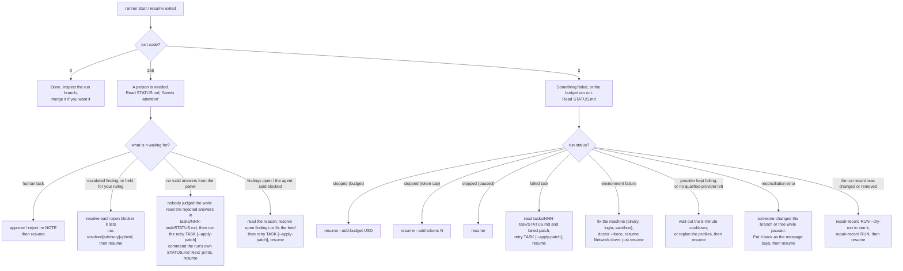

# Runbook

The recovery rows in sections 3 and 4 for a
blocked and a failed task are run by `tests/test_runbook.py` against a scratch repository, so they
cannot drift from what the commands do. The test suite also covers budget and token stops, pause, provider failures, retry, branch safety and
parallel process cleanup.

For the ideas behind these procedures, read the [tutorial](tutorial/README.md).

## The decision chart



## 0. Choose where the record goes

> [!IMPORTANT]
> **`--runs-dir DIR` decides where every run's artifacts are kept.** Without it the record is the
> hidden `.runs/` at the top of the repository. With it, each run gets its own directory
> `DIR/<workflow>/<workflow>-<UTC start>-<uuid8>/`: a meaningful name plus the run's UUID prefix,
> matching its branch `run/<workflow>-<uuid8>`. The option goes **before** the command (after it,
> the runner refuses and says so) and is relative to the top of the repository:
>
> ```sh
> runner --runs-dir runs start workflows/queue.toml
> runner --runs-dir runs status
> runner --runs-dir runs resume
> ```
>
> The option is not remembered. **Every** later command on those runs (`status`, `activity`,
> `runs`, `pause`, `resume`, `approve`, `reject`, `resolve`, `retry`, `replan`, `prune`, `check-gates`, and `doctor`, whose
> cache lives there) needs the same `--runs-dir`, or it answers `no runs directory …`. To avoid
> repeating it, export `CODE_SMITH_RUNS_DIR=runs` (also relative to the top of the repository), or
> set it in the workflow: `runs_dir = "runs"` under `[defaults]`. A workflow's `runs_dir` is used
> by every command given that workflow, and `start` remembers it in the repository's git config
> (`codesmith.runsdir`), so `status`, `resume` and the other commands on a RUN find it with no
> option; the option and the variable win over it. The directory writes its own
> `.gitignore`, so it never dirties the tree; listing it in the project's `.gitignore` as well is harmless and
> makes the intent visible.

Wherever this runbook says `.runs/`, read: the directory you chose.

## 1. Before the first run

To start from a template rather than a blank file: `runner new --list`, `runner new TEMPLATE
--describe`, then `runner new TEMPLATE -o WORKFLOW --params P.toml` (`implementation`,
`debugging`, `refactoring`; example parameter files in `examples/templates/`). It writes the file
only if it loads; read it, edit it, commit it, and continue with step 1.

1. `runner validate WORKFLOW`. Fix every error. Read the warnings and the expanded DAG; check that
   each claim of a frozen file is intended.
2. `runner graph WORKFLOW -o wf.dot` if you want to look at the shape.
3. `runner doctor WORKFLOW`. Qualifies each agent profile per capability. It costs a little money
   and is cached. Each profile also prints an "observed activity" line. For a Claude profile with
   none, doctor names the cause it found by reading the driven project's own files — never by
   running anything — rather than a generic hint: no `.claude/settings.json` (or
   `settings.local.json`) in the work tree defines hooks at all; hooks are defined but none of them
   invokes a logger that writes to `HOOK_LOG_DIR`; or the definitions look right but nothing was
   recorded (check the trust prompt, and whether this profile ignores project settings). See
   [headless observability](headless-observability.md#claude-activity-depends-on-the-driven-projects-own-hooks)
   for which settings file to add, how `HOOK_LOG_DIR` reaches the logger, and what to copy from
   this repository to get activity in a target project.
4. `runner check-gates WORKFLOW` runs each command in a clean clone of the **committed** files:
   files that are ignored or untracked are not there. Every `new` gate with a `fail_pattern` should
   report `fails as intended`. A `new` gate that passes (`objection`) cannot show the task was done;
   one that fails with no `fail_pattern` is reported as `fails (no fail_pattern to confirm the reason)`. A gate or
   check on an output that does not exist yet also reports `fails as intended`, with `(waits for
   TASK)` when that output belongs to an upstream task (a glob output is named by its directory,
   e.g. `tests/characterisation/x`); an `expect = "fail"` gate on its task's own missing output does
   too, and so does one that cannot run because the script it runs is that missing output. A gate that leaves
   files behind is an `error` and must be fixed, or its products ignored by git.
5. Make sure the work tree is clean. There is no option to start dirty.

## 2. Starting and watching a run

- `runner [--runs-dir DIR] start WORKFLOW` creates a run directory
  `<workflow>-<UTC start>-<uuid8>` (see section 0), **checks out `run/<workflow>-<uuid8>` and leaves
  the checkout there** (also when the run stops or finishes), and works until it is done or needs
  something.
- While it runs, use `runner activity latest --tail 20` for recent agent tool/hook events. See
  [headless observability](headless-observability.md) for provenance and missing-event limitations.
- While it runs, read `.runs/<workflow>/<run>/STATUS.md`, or `runner status --watch` (prints it
  again whenever it changes; Ctrl-C ends it), or `runner status --open` (opens `STATUS.html`, the
  same page with links to every prompt, log, outcome and verdict, reloading itself every 15 s). It
  is regenerated on every state change, and a working runner also refreshes it every
  `status_refresh_s` seconds (default 15): its first line says when the run last changed and its
  status, **Progress** counts accepted tasks, attempts, budget, elapsed time and where the time
  went (agent calls, gates, replays, stopped for a person), **In flight** lists
  each agent call and command that has begun, its attempt and step, when it started and how long
  it has been running, with an "As of" time and what runs next, and **Recent events** shows the
  last ten lines of `events.jsonl`, each outcome with how long it took. An old "As of" time means no runner is working on the run (it
  was stopped or killed): `runner resume`.
- `runner status RUN` only reads while a runner works on that run; `runner status --rebuild` is
  refused (exit 2) then, because that runner keeps the files current. When no runner works, `status`
  regenerates the files, taking the repository lock briefly.
- **To stop a run on purpose** (the machine is going offline, or you want to change something):
  `runner pause RUN`. The runner finishes whatever call or command is in flight, stops before the
  next one, and the command prints `runner resume RUN` when it has. Nothing is lost and there is
  nothing to reconcile. `--wait MIN` bounds how long the command waits (default 60); a long agent
  call can take a while to reach that point. If you cannot wait, `runner pause RUN --now` sends the
  runner SIGTERM (it is addressed through the run lock, so the right process is hit): the call in
  flight is discarded and `resume` reconciles and calls the author again in the same attempt: an
  interrupted call uses no protocol try and no attempt (five interruptions in one attempt set the
  task aside as blocked, see section 3). What the discarded call used is read from the provider's
  own record (its dollars, for Claude, stay unknown).
  Either way, budget can only be added on the resume: `runner resume RUN --add-budget USD`, or
  `--add-tokens N` for a run whose `run_budget_tokens` stop line was reached.
- **Do not edit the work tree or the run branch while a run is active or paused.** `resume` will
  refuse to continue if you did.
- **A malformed answer is repaired, not redone.** An oversized summary or invalid response IDs
  after a successful producer call is repaired without repeating the task. A qualified session
  resumes with an answer-only prompt; otherwise an already qualified read-only profile is used.
  Without either capability the full authoring retry remains. Inspect the invocation's
  `prompt.md` and `repair.json`: edits by a write-capable repair are recorded and verified
  normally; a read-only repair that writes is restored and the task fails. Repairs consume
  protocol retries and call budget, not extra attempts. After an interruption, `runner resume`
  continues the saved repair, subject to the remaining retry allowance; the interrupted call
  itself uses no retry.

## 3. Stops that need you

| STATUS.md says | Do |
|---|---|
| waiting for approval of TASK | Review the candidate in the work tree. `runner approve RUN TASK` or `runner reject RUN TASK -m "why"`. Then `resume` |
| finding X is escalated | Read both sides in `findings.json`. `runner resolve RUN X --as resolved\|advisory\|upheld -m "why"`. Then `resume`. In a script, add `--by NAME`: the ruling records how the name was given, whether a terminal gave it and any agent-session variable present, and `rulings_require_interactive = true` refuses `resolve`, `approve` and `reject` from a non-terminal or an agent session, `--by` or not: run them yourself in a terminal |
| TASK is held for your ruling on X, Y | Every blocking finding of the held task needs a ruling, the escalated one and any ordinary one beside it: `runner resolve` each (STATUS "Next" lists them). No approval follows |
| TASK: your rulings are complete | `runner resume RUN`. It continues acceptance (up to a person who verifies the task, when there is one), or sends the work back for an upheld finding |
| stopped: the token cap … (N measured + M held for K calls with unknown usage …) | M tokens were never measured: they are held for the named calls, whose usage could not be read. Look at those invocations; `runner resume RUN --add-tokens N` continues |
| TASK is blocked: the agent said … | The brief, the inputs or a gate is wrong. Fix the workflow, then, in either order, `runner replan RUN` and `runner retry RUN TASK --apply-patch` to keep the set-aside work (`runner retry RUN TASK` starts clean instead; nothing at all is needed once a replan has already reset the task to pending). Then `runner resume RUN` |
| TASK is blocked: attempts ran out with findings open | Read the findings. Rule on each with `runner resolve RUN FINDING --as resolved\|advisory\|upheld --note "why"`, then `runner retry RUN TASK --apply-patch`, or change the brief and `runner retry RUN TASK` to start clean. Then `runner resume RUN` |
| TASK is blocked: the reviewers could not answer in the required form | Nobody judged the work. Read the rejected answers in `tasks/NNN-task/STATUS.md`, then run the exact `runner retry RUN TASK …` command the **run's** `<run>/STATUS.md` "Next" section prints — `--apply-patch` when there is set-aside work to put back, plain `retry` when the attempt changed nothing. Then `resume` |
| TASK is blocked: N calls of attempt K were interrupted before they returned | Something stopped the runner five times inside one attempt (`pause --now`, a kill, a machine going to sleep); no attempt was used and the work is in `failed.patch`. Find what keeps stopping it, then `runner retry RUN TASK --apply-patch` to continue from the work, or `runner retry RUN TASK` to start clean. Then `runner resume RUN` |
| TASK is blocked: one reviewer could not answer in the required form and another did not finish | One reviewer's answers were rejected and are summarised in `tasks/NNN-task/STATUS.md`; the other's own cause (a timeout, an error, an interruption) is named beside it. Read both, then run the exact `runner retry RUN TASK …` command the **run's** `<run>/STATUS.md` "Next" section prints — `--apply-patch` when there is set-aside work to put back, plain `retry` otherwise. Then `resume` |
| stopped: paused at the owner's request | `runner resume RUN`. The run stopped before a call, so there is nothing to reconcile (`runner start` or `resume` exited 2) |
| stopped: out of budget | `runner resume RUN --add-budget 20` |
| stopped: the token cap for agents that report no cost is used up | `runner resume RUN --add-tokens 2000000`. STATUS.md's spend line shows the usage against the cap |

## 4. Failures

| Situation | Do |
|---|---|
| A task failed | Its work is in `tasks/NNN-task/failed.patch`, and the tree is back at the last accepted state. Read the last attempt's `gate.log`. `runner retry RUN TASK` to start clean, or `runner retry RUN TASK --apply-patch` to continue from the failed work — a commit of workflow or brief edits made since the set-aside does not prevent this, but an acceptance since does. Then `runner resume RUN` |
| A task was sent back: `` `CMD` passed in the work tree but did not pass … on a clean checkout of the candidate `` | The acceptance replay ran the gate again on a fresh checkout of the candidate, without the files git ignores, and it failed there. The feedback and `verification.json` (`replay.ignored_in_work_tree`) name the ignored paths the checkout lacked; the author is told to commit what the gate needs. If the gate truly needs a slow-to-rebuild cache, name it in `gate_cache`; to stop the replay for one task or the workflow set `acceptance_replay = false` and `runner replan RUN`. Nothing else is needed: the next attempt runs on its own |
| The runner was killed during an acceptance replay | `runner resume RUN`: it removes the throwaway checkout named in the `replay` intent and verifies the candidate again (beside a panel: runs the replay again with the reviewers not yet answered, keeping the answers saved); no attempt is used |
| Environment failure | No producer attempt was used; any reported cost remains in the record. Fix the cause, `runner doctor WORKFLOW --force`, `resume` |
| The network is down (`the network is down: the call of … could not reach the provider`) | No attempt was used, and the cached qualification is kept, since nothing is wrong with the profile. Just `runner resume RUN` when the network is back |
| `the provider kept failing on task …` | The provider failed on every try (capacity, overload, a dropped connection); no attempt was used. Wait, or `runner replan RUN` to change the task's profile or add a `fallback_agents` entry, then `runner resume RUN` |
| `no qualified available provider for …; saved work retained`, or `quota exhausted for … no qualified available fallback` | The provider reported quota and no authorized fallback is qualified and out of cooldown. The saved work is kept. Wait out the five-minute cooldown, or `runner replan RUN` with other profiles, then `runner resume RUN`. See [provider routing](provider-routing.md) |
| `an invocation's cleanup is open: cleanup open for …` (from `approve`, `reject`, `retry`, `resolve`, `replan`, `resume`, or the stop line) | The answer is saved (for a call cancelled before release, `cancelled before release`: it did not run and spent nothing), but its group is not confirmed empty. The record is intact: `repair-record` does not help. A plain `runner resume RUN` closes it only when the group is already gone and signals nothing; `runner resume RUN --stop-orphans` stops the group, closes the cleanup, removes a replay checkout the group ran in, and uses the saved answer (PROC-21, PROC-22) |
| The run stopped with `an invocation's cleanup is open …` (event `cleanup-stop`) | Not your pause: a `runner pause` you asked for stays waiting and is honoured at the next safe point once the cleanup closes. Follow the remedy at the end of the line (`--stop-orphans`, else `--abandon-cleanup`); a plain `resume` refuses while the group lives (PROC-30) |
| `qualification probe '…' of profile '…' left process group N running` (from `resume` or `start`) | A probe's group outlived its stop and may still be spending; its spend is recorded and the profile is not cached. Stop the group yourself (`kill -TERM -N`), then run the same command again (`runner resume RUN`, or `runner start` when no run was created), which qualifies again (PROC-31) |
| `could not close it: an invocation's cleanup is open …` from `resume --stop-orphans` | The stop keeps failing (a detached witness, an identity that cannot be verified). The message names no pids: find the invocation's processes yourself (`ps -o pid,pgid,command`, the group of the invocation's supervisor), verify them, and stop what remains. Then `runner resume RUN --abandon-cleanup [--by NAME]`: your ruling that the processes are gone or may be left. It signals nothing, records the obligation `abandoned` with who ruled and how (as `resolve` does; `rulings_require_interactive` refuses it from a non-terminal or an agent session) and a `cleanup-abandoned` event, then continues (PROC-23). If a call left by a killed runner is also still running, give `--abandon-cleanup --stop-orphans`: the cleanup is abandoned and that call's group stopped in one resume (PROC-28) |
| The runner was killed | `runner status` names the call it left behind as interrupted (while a runner is alive, an open call is listed under "In flight" instead). `runner resume`. It reconciles first, and calls again in the same attempt: an interrupted call uses no protocol try and no attempt. If an invocation still has live group members, it refuses and names the invocation and pids; `resume --stop-orphans` stops the whole group first |
| `the child process of task … is still running (invocation …; pids …)` | Run `runner resume RUN --stop-orphans`; it waits for the recorded invocation to stop before starting work, even if the supervisor died after the CLI identity was saved. A CLI leader exiting does not clear its descendants. Linux also tracks detached descendants while their ancestry is available; macOS cannot track a `setsid` daemon. Claude/Codex detach behavior is unverified. If no saved identity still matches a live member, inspect the listed pids and stop remaining processes yourself after verifying them, then resume. Do not signal a numeric group solely because an old record names it |
| Reconciliation error | The message states what was expected and what was found. Restore that, then `resume`. The runner will not guess |
| `reverting … conflicts: the index or the work tree has changes of its own` | A reopen revert met your own uncommitted changes. Nothing was committed or discarded. Commit or stash them, then `resume` |
| `another runner holds this repository` | A runner is working in this repository (or on this run). Wait for it, or `runner pause RUN`. A lock left by a runner that died is released by the kernel and taken over by the next command. The lock file it names is in the git directory (`.git/code-smith/run-….lock`), where `git clean` and `rm -rf .runs` cannot remove it, or `.runs/lock` for an older runner. When the message says `recording in DIR` and names `.git/code-smith.lock`, that runner works on this checkout with another runs directory: give the same `--runs-dir DIR` to reach it |
| `a git operation is in progress in the work tree (MERGE_HEAD …)` | An author or a gate left a merge, rebase, cherry-pick, revert or bisect half-done. No attempt was used. Abort it (`git merge --abort`, `git rebase --abort`, …) without touching the files, then `runner resume RUN`: the runner puts its branch back and judges the files as they are |
| The run record was changed (`the run record was changed: … was changed`, or `… was removed`) | Someone edited or deleted a decision file or a frozen definition. `runner repair-record RUN --dry-run` lists each pinned file that is missing or changed, with both hashes; `runner repair-record RUN` puts them back from `refs/code-smith/<run>/_record`, with a `record-repaired` event. Then `runner resume RUN` |
| The run record was deleted (`the run record was removed while the runner worked`, after `git clean -fdx` or `rm -rf .runs`) | The runner saved its state and stopped (`stopped`, not `failed`). `runner repair-record RUN` puts back the decision files and the event history before the loss, and names the attempts whose logs are gone (not restorable; their outcome is in the state). Then `runner resume RUN`. A run recorded before the pinned record existed has none: put its files back by hand |
| `the run record was changed: state.json was changed` (from `approve`, `reject`, `retry`, `resolve`, `replan` or `resume`) | `state.json` differs from its pinned copy of the same save: an edit. Nothing was written. Repair with `repair-record RUN` (it puts the pinned state back), then repeat the command |
| `kept      state.json on disk is newer than the pin` from `repair-record` | A pin failed after that save (see `record-pin-failed`). The later state and its manifest were kept; only the files that agree with it were put back, and the integrity check names the rest. `repair-record RUN --accept-older` puts the older pinned state back instead: the last resort, since it forgets what the run did after it |
| `record-pin-failed` in events.jsonl, or "The pinned copy of the record is stale" in STATUS.md | The runner carried on; the pin is retried at every save. The event says what git said (a `_record.lock` left behind, a permission, a corrupt object). Fix that; the next save pins again and the line goes. An edited earlier line of `events.jsonl` does not fail the pin: see `events.jsonl was changed` |
| `events.jsonl was changed`, or `record-events-changed` in events.jsonl | An earlier line of the log was edited (it only ever grows). The pinned history and every other file stay pinned, and every command that writes into the record refuses. `runner repair-record RUN` puts the pinned history back in front of the events logged since; then continue |
| `the pinned record refs/code-smith/…/_record was moved by something other than this runner` | Something rewrote the pin (another tool, a writer with your uid). The run stopped `failed` and left the ref alone. Look at the ref and at what moved it. If the move was yours or harmless, `git update-ref -d` the ref named in the message; the next `resume` pins the record afresh |
| `the pinned copy of … is missing or corrupt in git` from `repair-record` | A pinned object cannot be read (a power loss, a pruned object). Nothing was changed. Put the named file back by hand, or delete the ref so the next save pins afresh |
| `record-ignore-restored` in `events.jsonl` | Something removed the runs directory's `.gitignore`; the runner wrote it again and carried on. Nothing to do |
| `the run record is visible to git` | The runs directory's `.gitignore` is as the runner wrote it, yet git sees the record (a negation in another ignore file, say). Nothing in the record was touched. Make git ignore it again, then `runner resume RUN` |
| `render-failed` in events.jsonl | The state was saved and the runner carried on. The event names the page or task, exception type and message; each failing page is named once until it renders again, and the other pages are still written. Run `runner status --rebuild RUN` to see the error, which it reports as `runner: status: PAGE: TYPE: MESSAGE` with exit 2; after fixing it, the same command restores every page |
| `The run state breaks an invariant: …` in STATUS.md | The runner carried on. It is a runner bug: keep `state.json` and `events.jsonl` (the `invariant-violation` event) and report it |

## 5. Changing the plan mid-run

- Settle any active producer transaction. Edit and commit the workflow definitions so the tree is
  clean, then `runner replan RUN` (or pass an external revised file with `--workflow FILE`). It shows the difference per task and applies
  what is safe: new tasks, edits to tasks that have not been accepted.
- Changing an accepted task needs `runner replan RUN --reopen TASK`. The runner lists everything
  affected and undoes those commits with **revert commits**, newest first. The branch is never
  reset. If a revert conflicts, it stops and changes nothing further.

## 6. After a run

- The run branch stays checked out. Going back to your branch and merging are your call; the runner
  never pushes or merges.
- `STATUS.md` is written by the runner when its own state changes, and a merge is not one of those
  changes. `runner status RUN` therefore refreshes a **finished** run every time it is asked, and
  the "Next" section then says whether the last accepted commit is in the branch the run came from
  and in that branch's upstream (as last fetched). Opening the file without running `status` shows
  it as of the last refresh.
- `runner runs [WORKFLOW]` lists runs with status, cost and date (and estimates and rate-limit
  windows, when any); WORKFLOW is a workflow file or its name, and without it every run is listed.
- To delete a run: remove its directory, then `runner prune --orphans` to delete its pinned refs
  under `refs/code-smith/`. Plain `runner prune` deletes the refs of finished runs whose directory
  exists, and names (but keeps) the refs of a run whose directory it cannot find, which may live
  under another `--runs-dir`.
- To have an agent explain a run: give it the run directory's path. `STATUS.md`, `index.json` and
  `.runs/README.md` are written for that reader.

## Where to look

| Question | File |
|---|---|
| What is the run doing, and what does it need? | `<run>/STATUS.md` |
| What exactly was the agent told? | `tasks/NNN-task/attempt-N/prompt.md` |
| What did the agent print? | `…/attempt-N/invocation-N/stdout.log`, `stderr.log` |
| Why did the attempt not pass? | `…/attempt-N/gate.log`, `reverted.json`, the next attempt's `feedback.md` |
| What did review find, and was it fixed? | `tasks/NNN-task/findings.json` |
| What did a rejected reviewer answer say? | `tasks/NNN-task/STATUS.md`, then the `invocation-N/last-message.txt` it names |
| What work is waiting to be put back, and how | `tasks/NNN-task/set-aside.json` |
| What was verified against which candidate? | `…/attempt-N/verification.json` |
| What did it cost? | `run.json`: known, reserved, unpriced and unsettled spend |
| Everything, in order | `<run>/events.jsonl` |
