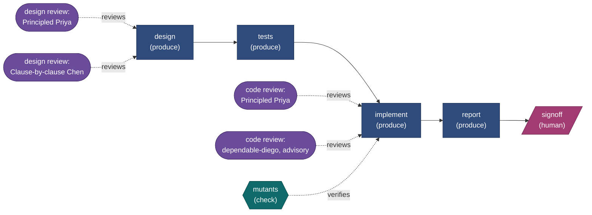
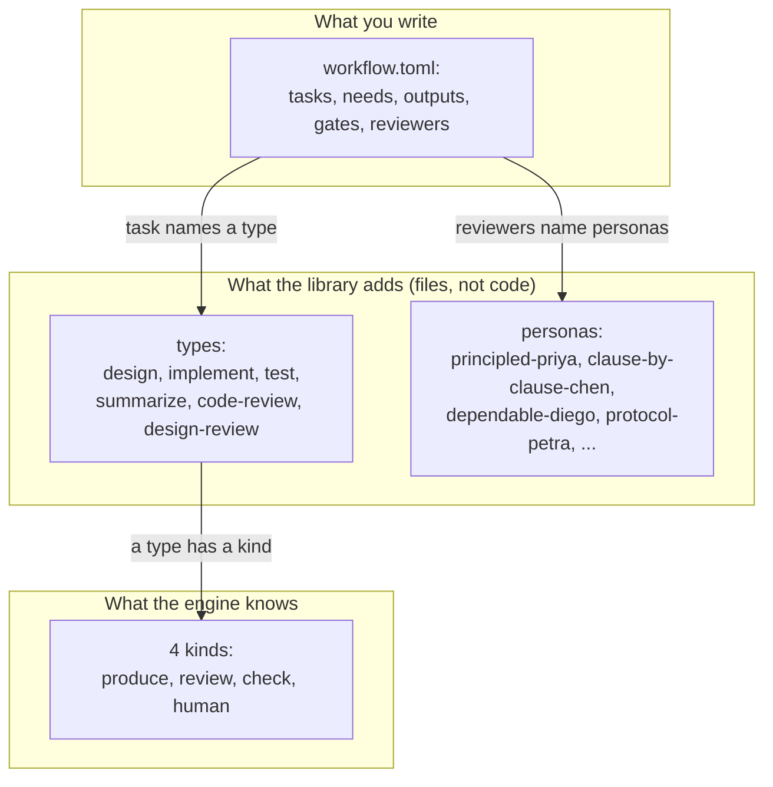
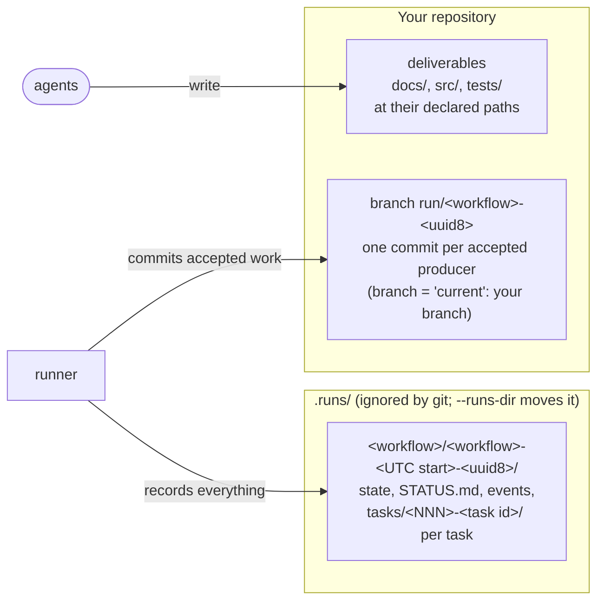

# 1 — The idea

> [!NOTE]
> **Time: 10 minutes.** No model was called.

## The problem

A coding agent run by hand does one thing well while you watch. Real work is a chain: design it,
review the design, write tests, implement, review the code, summarise. Run unattended, that chain
fails in predictable ways:

- the agent says "done" and it is not;
- a reviewer objects, the author "fixes" it, and nobody checks the fix;
- two reviewers keep finding new things for ever;
- a crash half-way leaves the repository in a state nobody can name;
- afterwards, nobody can say what happened or why.

code_smith is a small program that runs such a chain to completion and is built around not
failing in those ways. It drives agents such as Claude Code and Codex in headless mode; it contains
no model itself and makes no model calls of its own. (The one exception you start yourself:
`runner doctor` sends small probe prompts through the same agent CLIs to prove what each can do,
and that costs money.)

## The shape of a workflow

You describe the work as tasks. `needs` joins them into a graph with no cycles.

Colour marks the kind of each task. Solid arrows are `needs`: *implement* starts only when *tests* is **accepted**. Dotted arrows are
verification: those tasks judge a producer's work before it can be accepted.

## Four kinds of task

Every task is one of four kinds. The engine knows only these.

| Kind | What it does | Who acts |
|---|---|---|
| `produce` | Creates or changes files | An agent with write access |
| `review` | Judges one producer's work from one perspective, read-only | An agent, in a new session |
| `check` | Runs commands; passes if all exit 0 | The runner. No agent |
| `human` | Pauses until a person approves or rejects | A person |

On top of kinds sit **types**: template files such as `design`, `implement`, `code-review`. A type
is a kind plus a prompt template and defaults. Adding a new type of work means adding a file, not
code. Review types take a **persona**, also a file, which says what that reviewer cares about, what
justifies blocking, and what to leave to others.

## Five rules everything follows from

1. **Nothing is accepted on an agent's word.** Every producer must have a verifier, or the workflow
   does not load. The agent's own "done" is recorded and never used.
2. **`needs` means accepted.** Nothing builds on unreviewed work. Accepted outputs are frozen: a
   later task cannot change them unless it says so openly in its `writes`.
3. **One loop only, and it is bounded.** A rejection sends the work back to its author with the
   reasons, up to `max_attempts`. There are no other cycles.
4. **One producer owns the work tree at a time**, from its first write until its work is committed
   or set aside. So a review never sees another task's half-finished changes, and a commit never
   contains them.
5. **Everything is on disk.** The runner keeps nothing in memory between steps. `resume` after a
   crash is the normal way of working, and the record can be read cold by a person or an agent.

## Where deliverables and records live

Deliverables live in the repository, where gates can build and test them. The run directory is the
record of how they came to be, laid out like a build directory. A real one, from the demo you will
run in chapter 2, is `.runs/command-demo/command-demo-20261001T024014Z-05b87e28/`, with one
directory per task: `tasks/010-write/`, `tasks/020-check/`, `tasks/030-signoff/`. The numbers
step by ten in workflow order, so a task added later by `replan` fits between.

## Check yourself

Answer each from memory first, then open the answers.

1. An agent reports "done, all tests pass". What does the runner do with that claim?
2. `tests` and `implement` are both producers and `implement` needs `tests`. When can `implement`
   start, and can it edit `tests/book/x.cpp`?
3. Name the four kinds of task, and say which one involves no agent and no person.
4. Why is "one producer owns the work tree at a time" needed, when only one agent writes at a time
   anyway?

Answers

1. Records it and ignores it. Acceptance comes only from verifiers (gates, checks, reviewers,
   people), and a producer with none does not load (rule 1).
2. Only once `tests` is **accepted**. Its outputs are then frozen: `implement` can change them only
   by claiming them openly in its `writes` (rule 2).
3. `produce`, `review`, `check`, `human`. A `check` is run by the runner itself.
4. Because a producer's *transaction* lasts past its writing: gates, panel and commit follow. If
   another producer wrote in between, its changes would leak into the first one's review and commit
   (rule 4; chapter 5 shows the timeline).

---

| Previous | | Next |
|:--|:-:|--:|
| [Contents](README.md) |  | [2 — A task, end to end](02-a-task-end-to-end.md) |

**Reference:** [02 — Concepts](../02-concepts.md).
