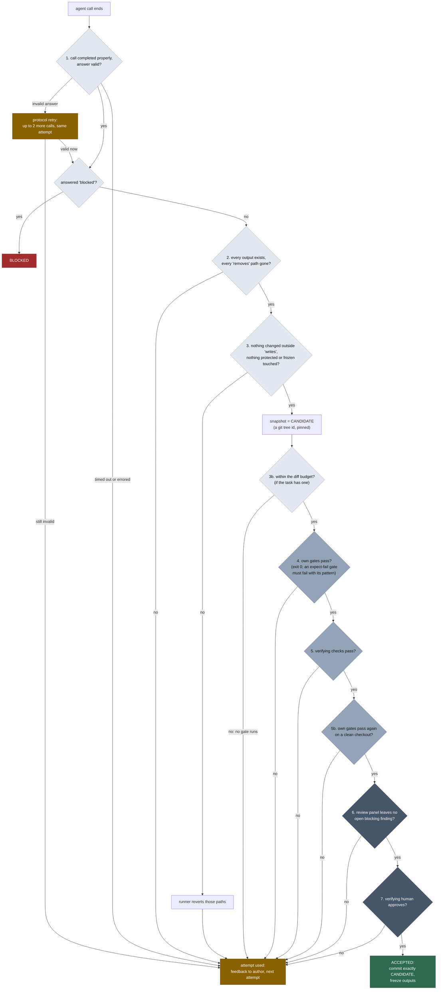
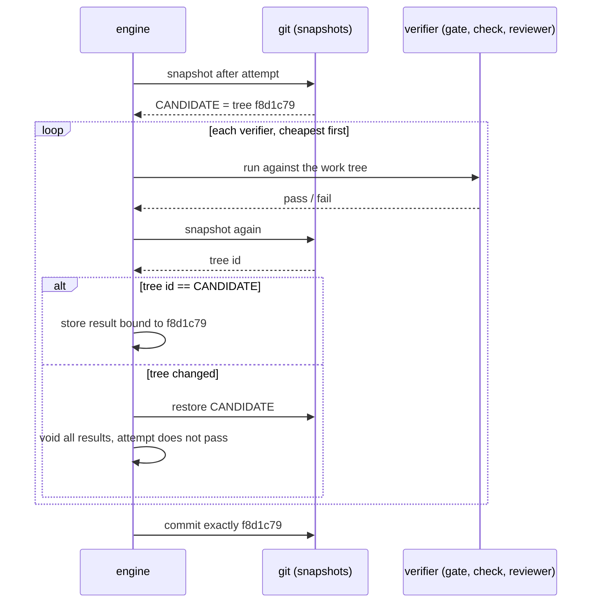
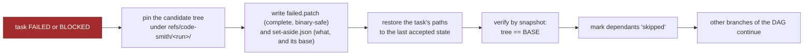

# 2 — A task, end to end

> [!NOTE]
> **Time: 30 minutes, including a 5-minute hands-on run.** No model was called.

This chapter follows one producer, `implement`, from the moment it becomes ready to the moment its
work is a commit. Everything else in the runner exists to make this path trustworthy.

## The states a task passes through

```mermaid
stateDiagram-v2
    [*] --> pending
    pending --> running: everything in needs is accepted,<br/>and it becomes the active producer
    pending --> skipped: something upstream failed or is blocked
    running --> verifying: attempt passed the free checks
    running --> rework: output missing, wrote outside writes,<br/>or the call failed (time-out, error, invalid answer)
    verifying --> rework: a gate, check, reviewer or person sent it back
    rework --> verifying: the next attempt passed the free checks
    verifying --> waiting_human: needs approval, or a finding is escalated
    waiting_human --> verifying: approved, or finding settled
    waiting_human --> rework: rejected, or finding upheld
    verifying --> accepted: every verifier passed on one candidate
    running --> blocked: agent answered blocked, or five calls<br/>of one attempt were interrupted
    verifying --> blocked: the panel could not give valid answers
    rework --> failed: attempts used up, last sent back by a gate,<br/>a check or a failed call; or no progress
    rework --> blocked: attempts used up, last sent back<br/>by a reviewer or a person
    accepted --> [*]
    failed --> [*]
    blocked --> [*]
    skipped --> [*]

    classDef ok fill:#2d6a4f,stroke:#1b4332,color:#ffffff
    classDef rework fill:#8a6100,stroke:#5e4200,color:#ffffff
    classDef human fill:#a23b72,stroke:#742951,color:#ffffff
    classDef stop fill:#a32d2d,stroke:#741f1f,color:#ffffff
    classDef aside fill:#64748b,stroke:#475569,color:#ffffff
    class accepted ok
    class rework rework
    class waiting_human human
    class failed,blocked stop
    class skipped aside
```



`rework` is simply "a later attempt is under way". `failed` means the work could not be done;
`blocked` means a person must decide something an agent cannot.

The verifiers that judge a producer (reviews, checks, human approvals) have a shorter life. Each
round ends `accepted` or `objected`:

```mermaid
stateDiagram-v2
    [*] --> pending
    pending --> accepted: passed this candidate
    pending --> objected: blocked it, failed, or a person rejected
    objected --> pending: the producer reworked; next round
    accepted --> pending: the producer reworked; checked again
    objected --> skipped: its producer ended failed or blocked
    accepted --> [*]
    skipped --> [*]

    classDef ok fill:#2d6a4f,stroke:#1b4332,color:#ffffff
    classDef rework fill:#8a6100,stroke:#5e4200,color:#ffffff
    classDef aside fill:#64748b,stroke:#475569,color:#ffffff
    class accepted ok
    class objected rework
    class skipped aside
```



**Exit codes belong to the run, not to a task.** `0`: every task is accepted. `255`: some task is
`blocked` or `waiting_human`, so a person is needed. `2`: anything else, including a run halted by
`runner pause`, by the budget or token cap, or by an environment, network or provider failure.
Such a run keeps its work and continues with `runner resume`.

## The acceptance ladder

An attempt climbs a ladder of verifiers, **cheapest first**. The first failure stops the climb and
sends the work back, so money is never spent reviewing work that does not build.



The darker the step, the more it costs: pale steps are free, mid-grey steps cost seconds to
minutes, dark steps cost agent calls or a person's time. A producer must have at least one of steps
4 to 7, or the workflow is rejected when it loads.

The attempt is counted the moment the call ends, before step 2, in the same save that records the
answer. So a crash anywhere after that resumes by inspecting what the attempt left, and never
spends a second attempt on work already done.

A call that never ends is a different case. If the runner is killed, or you run `runner pause
--now`, while the author is working, the call is recorded as **interrupted**: `resume` calls the
author again in the same attempt, and the interruption uses neither the attempt nor one of its
retries. Only something that keeps stopping the runner (five interruptions in one attempt) sets
the task aside as `blocked`, for a person to find out why.

## Every result is tied to one candidate

Here is the subtle point. A gate might pass, and then a later check might quietly rewrite a source
file. If the runner committed the tree at that moment, it would commit something no gate ever saw.

So after step 3 the runner records the candidate's tree id, and:

- every gate, check, verdict and approval is stored **with that tree id**;
- after every verifier the runner takes a new snapshot and compares;
- if the tree differs, the runner puts the candidate back, voids the earlier results, and the
  attempt does not pass. The feedback names the command and the files.



Two honest exceptions exist. A check whose job is to change source and put it back, such as a
mutation tester, is marked `restores = true`: the runner restores the candidate itself afterwards,
even if the tool crashed. And a check marked `read_only` may run beside reviewers, but the claim is
verified by snapshot, not believed.

## The gates once more, on a clean checkout

Snapshots see every file git sees. They do not see what git **ignores**, and gates run in your real
work tree, where ignored files live. Picture an author whose gate is `pytest`, in a project with a
stale `build/` directory from last week: the tests import an old compiled module from it and pass,
while a fresh clone of the commit would fail. No reviewer would ever see `build/`, because it is in
no diff.

So step 5b, the **acceptance replay**: once the live gates and checks pass, the runner runs the
task's own gates again, in order, in a throwaway checkout outside the work tree that holds exactly
the candidate's files and nothing git ignores. If a gate fails there, the attempt goes back like any
gate failure, and the feedback says the gate passed in the work tree but not on a clean checkout,
naming the ignored paths the checkout lacked. The checkout is removed afterwards. When the task has
reviewers, the replay runs beside their calls instead of before them, and a failing replay voids
their verdicts on that candidate. The replay is on by
default; chapter 6 shows how to turn it off or let a slow build cache in.

## Rework

A rework is a new **attempt**, in a new numbered directory. The author is told two things, in the
attempt's `feedback.md`:

1. the immediate cause: gate output, check output, rejection note or new findings;
2. every open blocking finding that still needs a response from it.

If the agent is qualified to continue a session, the rework continues it, which keeps its
understanding and reuses the provider's cache. If not, or after a time-out, an error, an
interruption or a switch of provider, a fresh session gets the full prompt plus the feedback. The
rules are the same either way.

A fresh session has lost its memory, but not its files: the runner never resets the work tree
inside a task. So when a new session starts over a tree that differs from the task's base, its
prompt opens with a notice, "Work of this task is already in the work tree", lists the changed
files, and tells the author to read them and continue, not start over.

Five counts are kept strictly apart:

| Counter | Counts | Limit |
|---|---|---|
| Producer attempts | each time the author's call ends, whatever sent it back | `max_attempts`, default 3 |
| Review rounds | per reviewer: the first time it sees a candidate is its round 1 | none of its own |
| Protocol retries | a call that **returned** with an invalid answer | 2 more calls; then the attempt is spent |
| Interruptions | a call that never returned: the runner was killed or paused with `--now` | none charged; the fifth in one attempt sets the task aside `blocked` |
| Provider failures | the provider, not the agent, failed: quota, overload, outage | never uses an attempt |

A protocol retry is a fault of the *call*, not of the work: while retries remain it uses no attempt
and never becomes a finding. When the author's call finished its work and only the answer is wrong
(a summary too long, a finding id misspelt), the retry is a short **repair**: the agent is sent its
own answer, what was wrong with it and the schema, and told to change no files. It continues the
same session where the profile is qualified to, or else makes a fresh read-only call, so nothing is
redone; a profile qualified for neither gets the full prompt again. After the third invalid answer the attempt
**is** spent, and the author is told its call did not end with a valid answer.

A provider failure is nobody's fault in the workflow. A quota refusal moves the task at once to the
next profile in its `fallback_agents`; an overload or dropped connection is called again, on a
fallback from the second failure on. With nowhere left to go, the run **stops** (exit 2) with no
attempt used; `runner resume` continues later. Chapter 6 shows how to configure fallbacks.

**No progress.** The task fails early only when a gate or check fails the same way **and** the
candidate tree is identical to the previous attempt's. The same error text after a real change is
not "no progress".

## When it goes wrong



Nothing is thrown away. `runner retry RUN TASK` gives the task fresh attempts from a clean tree.
`runner retry RUN TASK --apply-patch` first puts the set-aside work back, if its base is still the
accepted tree, and tells the author it is there. `STATUS.md` prints the exact command.

## Try it

Five minutes, no model, no API key. The agent in [`examples/`](../../examples) is a Python script
that writes `result.txt`; the workflow has a gate, a read-only check and a human signoff.

```sh
TR=/path/to/code_smith                       # the directory that holds `runner` and examples/
mkdir /tmp/demo && cd /tmp/demo && git init -q -b main
cp $TR/examples/command-demo.toml $TR/examples/command_agent.py .
git add . && git commit -qm demo
$TR/runner doctor command-demo.toml           # qualifies the script; no model involved
$TR/runner start command-demo.toml            # exit 255: waiting for signoff
```

```text
write: started
write: waiting for a person at 'signoff'. The work tree is held.
run command-demo-20261006T123812Z-5152a215: needs_human. See …/STATUS.md
run command-demo-20261006T123812Z-5152a215  (5152a215-570b-4f76-80c4-86f049ba89fa)
record  …/.runs/command-demo/command-demo-20261006T123812Z-5152a215
branch  run/command-demo-5152a215  (checked out; was main)
```

Now reject it. **Before running `resume`, predict:** how many attempts will `write` show, and why
will it stop again?

```sh
$TR/runner reject latest signoff -m "say it louder"
$TR/runner resume
$TR/runner status latest
```

```text
write: sent back (a person rejected the work at 'signoff')
write: waiting for a person at 'signoff'. The work tree is held.
…
| 010 | write | implement | scripted | waiting_human | 2 |  |  |
```

Two attempts: the rejection sent the work back, the author ran again, and the human verifier
judges every new candidate. Read `.runs/command-demo/*/tasks/010-write/attempt-2/feedback.md`: your
note arrives fenced as data. Then approve, and check the central claim of this chapter, that the
commit is exactly the verified candidate:

```sh
$TR/runner approve latest signoff && $TR/runner resume       # write: accepted as 06d3507
git show -s --format=%T HEAD
grep -m1 candidate .runs/command-demo/*/tasks/010-write/attempt-2/verification.json
```

```text
9f6cd7eaae7b41eba6911bcf51696dbd86d8e6fa
  "candidate": "9f6cd7eaae7b41eba6911bcf51696dbd86d8e6fa",
```

Your ids will differ from these; the two lines will match each other. The same
`verification.json` has a `replay` entry: step 5b, the gate `grep -qx 'Verified candidate'
result.txt` run once more in a throwaway checkout of tree `9f6cd7e…`, with `"result": "pass"`.

## Check yourself

1. The author's call returns an invalid answer three times in a row. What happens to the attempt
   count, and where does the work go?
2. A gate passes, then a read-only check rewrites `src/x.c`. What does the runner do?
3. A run stops because Claude's quota ran out and the task has no `fallback_agents`. Which exit
   code, and was an attempt used?
4. `max_attempts = 3`. The third attempt is sent back by a reviewer. `failed` or `blocked`? What if
   a gate sent it back?
5. You run `runner pause --now` while the author of attempt 2 is working, then `runner resume`.
   Which attempt does the author work in now, and how many retries has the interruption used?
6. A gate passes in your work tree and fails in the acceptance replay. What is the likely cause?
7. *(Chapter 1)* Why must every producer have at least one of steps 4 to 7?

<details><summary>Answers</summary>

1. The first two invalid answers are protocol retries on the same attempt. The third spends the
   attempt: the work goes back to the author with "your previous call did not end with a valid
   answer". It does not block the task.
2. Puts the candidate back, voids the results bound to it, and the attempt does not pass. The
   feedback names the command and the files.
3. Exit 2. No attempt was used and the saved work is kept; `runner resume` after the cool-down.
4. `blocked`: a reviewer or a person sent it back last, so a person must decide. After a gate it is
   `failed`.
5. Still attempt 2, and none: a call that never returned is an interruption, counted apart.
   Whatever it wrote is still in the tree, and the new session is told so.
6. A file git ignores (a stale build, a package in an ignored directory) that the work tree has
   and a clean checkout of the commit does not. The feedback names those ignored paths.
7. Because nothing is accepted on an agent's word (rule 1). Steps 1 to 3 only check the shape of
   the work; 4 to 7 judge it.

</details>

---

| Previous | | Next |
|:--|:-:|--:|
| [1 — The idea](01-the-idea.md) | [Contents](README.md) | [3 — Review panels and findings](03-review-panels-and-findings.md) |

**Reference:** [02 — Concepts, Acceptance and Rework](../02-concepts.md#acceptance),
[05 — Producer lifecycle](../05-architecture.md#producer-lifecycle),
[Runbook](../runbook.md) for every command.
