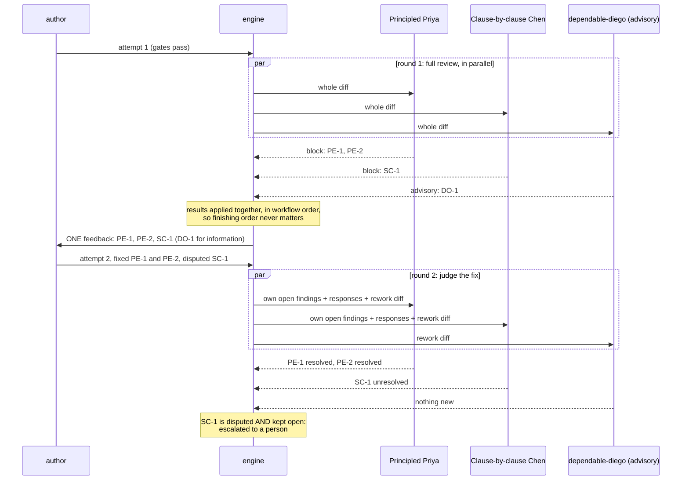
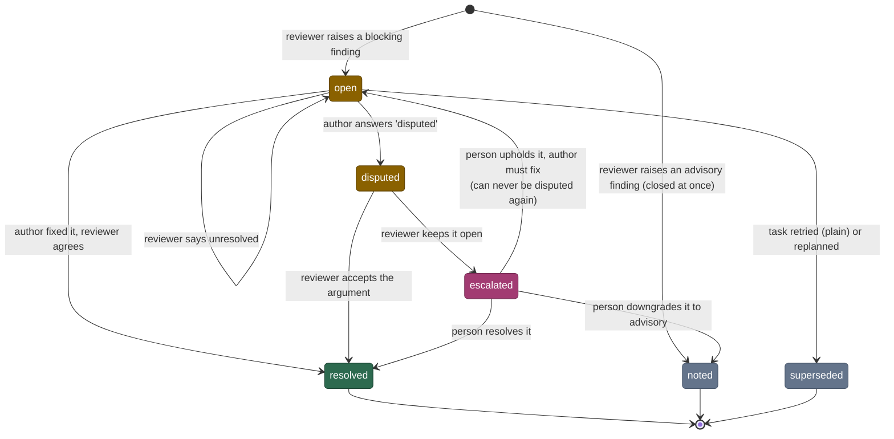
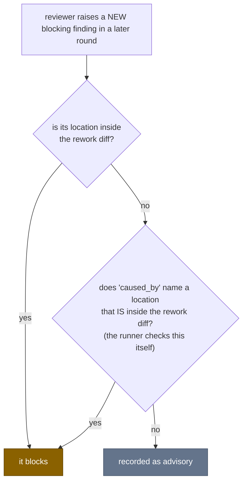
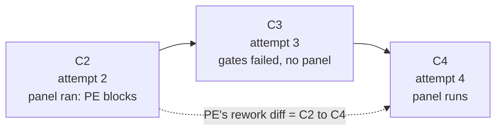

# 3 — Review panels and findings

> [!NOTE]
> **Time: 30 minutes, including a 5-minute hands-on run.** No model was called.

Several reviewers on one piece of work is where unattended pipelines usually break: they loop, they
contradict each other, or their objections are "fixed" with nobody checking. This chapter explains
the rules that make a panel converge.

## A panel is a list of personas

```toml
reviewers = ["principled-priya", "clause-by-clause-chen", { perspective = "dependable-diego", advisory = true }]
```

Each entry becomes its own review task, run by an agent in a **new, read-only session**, with a
persona that says what to look at, what justifies a blocking finding from that perspective, and
what is **out of scope**. The out-of-scope list matters as much as the focus: it stops five
reviewers raising the same general point.

An **advisory** reviewer can comment but never block.

**One ownership rule.** Each out-of-scope item names the persona that owns it, and the review
prompt lists who else sits on the panel. Specialist judgement stays with its owner: when the owner
is on the panel, the others cite the owner's finding instead of filing their own; when the owner
is absent, a reviewer raises the matter once, as advisory. There is one exception: a **directly
checkable violation of a requirement the brief or the project rules state**, quoted in the
finding's detail, **is blocking** when its owner is absent. "The brief says `parse()` rejects an empty string and it
returns 0" can block from anyone; "this API would be cleaner as two functions" is the API owner's
call.

**What a reviewer may do.** It reads the repository freely, but it is not authorised to build, test
or run the product (a rule of the review prompt, on top of the read-only session). The **execution
evidence is the gates' output**, which the
runner hands it: the tail of the current attempt's gate log (up to 8192 bytes), with the
candidate and attempt it belongs to. A defect a reviewer can only suspect, or one that needs an
experiment nobody ran, is advisory, with the experiment named.

## The whole panel runs before anything goes back



One consolidated rework instead of one per reviewer: a late objection does not cost several full
loops. A reviewer that passed is shown the rework diff in the next round too, so a fix that breaks
something it cares about is still seen; `recheck_passed = "never"` on a reviewer turns that off.

## Findings are tracked, not re-argued

A finding is a record with an id the **runner** assigns, such as `implement/PE-2`: producer,
persona code, number. It is unique in the run and stable across rounds.



`open`, `disputed` and `escalated` all block. Advisory findings never stay open: they are shown to
the author for information, need no response, and no later round is asked about them. Each one is
shown with the attempt and candidate it was raised on, so an author in attempt 3 can tell a stale
remark about attempt 1 from a fresh one. The author may list advisories it acted on in
`advisories_addressed`; that is its own unverified report, shown in later feedback and STATUS, and
it changes no verdict. `superseded`
happens only when a person restarts the task with a plain `runner retry` or with `runner replan`:
the open blocking findings of the old line of work are closed and every reviewer starts again at
round 1. `runner retry --apply-patch` puts the set-aside work back and keeps the findings open:
the author answers them first, and the reviewers judge the rework.

## Later rounds judge the fix, and only the fix

Round 1 is a full review. Without a rule, round 2 would be another full review, and a reviewer
could keep finding new blockers on untouched code for ever. So in a later round:



The second case exists because a rework can change a function and break an unchanged caller. The
reviewer may block on the caller if it names the changed function, and the runner verifies
mechanically that the named location really is in the diff.

"Inside" is decided mechanically, so locations must be exact: `path:line` or `path:line-line`,
relative to the workflow root or to the repository. A line next to a deletion counts, since the
deleted lines are no longer there to point at. A bare path counts only when the whole file changed:
added, deleted or binary.

**The rework diff is per reviewer.** It runs from the candidate that reviewer last saw to the
current one. If an attempt in between failed its gates and no panel ran, the diff spans that
attempt too, so nothing changed there escapes review.



## The verdict is computed, not believed

The reviewer's answer contains a `verdict` field, but the runner does not use it to decide. After
applying the answer to the ledger, the runner asks one question: *does this reviewer have an open
blocking finding?* An old finding left `unresolved` blocks even if nothing new was raised. If the
model's `verdict` disagrees with the computed one, the answer is invalid and the call is retried as
a protocol error.

This also blunts a whole class of manipulation: a reviewer cannot be talked into "pass" while its
findings are open.

The runner makes exactly one repair instead of a retry. A reviewer with nothing to resolve that
raises a new blocking finding and also lists entries in `resolutions` naming no finding in the
ledger: `[]` is then provably the right value, so the runner drops those entries, keeps the review,
and records a `repair` event in the new findings' history.

## When a reviewer's call fails

Each review job has three tries. An invalid answer, a time-out or a provider overload uses one; from
the second provider failure on, the review moves to a `fallback_agents` profile if it has one. A
quota refusal switches profile without using a try; a network outage or an environment failure
stops the whole run, to be resumed. A reviewer still broken after three tries does **not** cost the
author an attempt: the producer ends `blocked`. When the cause was invalid answers, `STATUS.md`
says `blocked (protocol)` and shows each rejected answer.

Reviewers are read-only, and that too is checked by snapshot. If the tree changed during a review
batch, the whole panel is **void**: the candidate is put back, none of that batch's answers is used,
and the task fails, unless a read-only check run alone proves to be the writer, which is then
demoted.

## Disputes go to a person

Two agents disagreeing is not something a third loop settles. When the author answers `disputed`
and the reviewer keeps the finding open, the finding is `escalated`:

- the producer becomes `waiting_human`, with its candidate **still in the work tree**;
- the run stops with exit 255, and STATUS says the task is **held for your ruling**;
- the person runs `runner resolve RUN FINDING --as resolved|advisory|upheld [-m NOTE] [--by NAME]` for **every
  open blocking finding** of that task, not only the escalated one (STATUS "Next" lists each), then
  `runner resume`.

After the last ruling STATUS says "your rulings are complete"; no approval is asked for. If no
blocker remains, acceptance continues from where it stopped. Every earlier result is bound to that
same candidate, so nothing is repeated and no attempt is used. `upheld` sends the work back: the
author must fix it, and may not dispute it again. Each ruling is kept in the finding's history
with who made it, when, the note and the candidate it was made on, and with how the name was given
(`by_source`: `flag` for `--by`, `env` for the login name), whether a terminal gave it
(`interactive`) and which agent-session variables were set (`agent_markers`, names only). STATUS
prints them: "ruled by owner (non-interactive, name from the environment; agent session markers:
CLAUDECODE)" is a ruling an agent may have typed under your login. The note is free text; keep
apart the decision, the scope you accept, the evidence shown and the claims nobody proved
(`runner resolve --help`).

A reviewer that keeps a dispute open and proposes a remedy must be able to show it (where it
compiles, or where the brief specifies it); otherwise it says the reading belongs to a person. That
keeps a third round from building a third interpretation.

**Ruling without a dispute.** A person may rule the same way on any open blocking finding of a
producer that ended `blocked`, for example when attempts ran out on a finding the person thinks is
wrong. Rule on each, then `runner retry RUN TASK --apply-patch` and `runner resume`: if no blocker
remains, the restored candidate is inspected and gated again **without another author call**, and
the reviewers whose findings were ruled on are satisfied by the ruling.

**Rulings travel downstream.** A task accepted with a person's rulings is marked "accepted with
owner rulings" in STATUS, and every later task that builds on it is shown those rulings beside the
author's summary, attributed and tied to the candidate they were made on. A downstream reviewer
then knows the deviation was a person's decision, not an oversight; it is not a general exception.

## One ledger per producer

Every finding from every reviewer and round, with its history, is in one file:
`tasks/<NNN>-<producer>/findings.json`, for example `tasks/010-make/findings.json`. "What did review
find, and was it fixed?" is answered by reading it. Because it decides every verdict, it is covered
by the record's integrity check from the first finding on.

## Try it

Five minutes, no model. [`panel-demo.toml`](../../examples/panel-demo.toml) has one producer and two
scripted reviewers; the Principled Priya always objects to the first wording. With `--dispute`
the author argues back instead of fixing.

```sh
TR=/path/to/code_smith
mkdir /tmp/panel && cd /tmp/panel && git init -q -b main
cp $TR/examples/panel-demo.toml $TR/examples/panel_agent.py $TR/examples/command_agent.py .
# edit panel-demo.toml: argv = ["python3", "-B", "panel_agent.py", "--dispute"]
git add . && git commit -qm demo
$TR/runner doctor panel-demo.toml
$TR/runner start panel-demo.toml              # exit 255
$TR/runner status latest
```

```text
| 010 | make | implement | scripted | waiting_human | 2 |  |  |
| 011 | make.review.principled-priya | code-review | scripted | objected |  |  |  |
| 012 | make.review.clause-by-clause-chen | code-review | scripted | accepted |  |  |  |
…
## Needs attention
- **Your decision is needed on make/PE-1**: a reviewer and the author disagree about "Use the final wording" (result.txt:1). Read the finding and the author's reply in tasks/010-make/findings.json, then `runner resolve`.
- **make is held for your ruling** on make/PE-1: `runner resolve` each one, then `runner resume`; no approval follows. See tasks/010-make/STATUS.md.
```

The history of `make/PE-1` in `tasks/010-make/findings.json` reads `raised`, `response`
(disputed), `resolution` (unresolved). **Predict before you type:** this scripted author disputes
every time. What happens if you uphold the finding?

```sh
$TR/runner resolve latest make/PE-1 --as upheld -m "use the final wording"
$TR/runner resume                              # exit 2
```

```text
make: sent back (the review panel has blocking findings)
make: sent back (your previous call did not end with a valid answer)
make: failed (3 attempts used; the last was sent back by agent). Its work is in failed.patch
```

In the third attempt the author disputed the upheld finding again, which is an invalid answer
(`make/PE-1 was upheld by a person and cannot be disputed again`). Its call had completed, so the
two retries were short answer-only **repairs**: open `attempt-3/invocation-2/prompt.md` to see the
whole of what such a call is sent (the rejected answer, that diagnostic, the required finding id
and the schema), and `repair.json` beside it, which shows the call was read-only and left the tree
unchanged. This scripted agent does not recognise a repair prompt and answers it with a review, so
after three invalid
answers the attempt was spent, which was the last one, and the task failed and its work was set
aside. `git status` is clean. In a fresh copy, `--as resolved` instead ends with `make: accepted as
…` and no further attempt.

## Check yourself

1. Three reviewers; one blocks in round 1. How many times does the author hear back?
2. In round 3 a reviewer raises a new blocking finding at `src/a.c:40`. The rework changed only
   `src/b.c:10-20`. When does it block?
3. A reviewer answers `verdict = "pass"` but leaves one of its findings `unresolved`. What happens?
4. A reviewer times out three times in a row. What happens to the producer, and is an attempt used?
5. The panel has a security reviewer but no API reviewer. The code reviewer thinks a public
   function's name is misleading, and also sees that the brief's required `--dry-run` flag is
   missing. Which of the two may it block on?
6. A task is held for your ruling on one escalated finding, and a second blocking finding is open
   beside it. You resolve the escalated one and `resume`. What happens?
7. *(Chapter 2)* Which file proves that what was committed is what the panel reviewed?

<details><summary>Answers</summary>

1. Once, with all the panel's findings together; the whole panel runs before anything goes back.
2. Only if its `caused_by` names a location inside the rework diff, such as `src/b.c:12`.
   Otherwise it is recorded as advisory.
3. The verdict disagrees with the ledger, so the answer is invalid and the call is retried as a
   protocol error. The computed verdict is `block`.
4. The producer ends `blocked`; no attempt is used. A person decides what to do (`retry`, or a
   replan to another profile).
5. Only the missing flag: it is a directly checkable violation of a stated requirement, and its
   owner is absent. The naming is the API owner's judgement, so with that owner absent it is
   raised once, as advisory.
6. The second finding still blocks, so `resume` sends the work back to the author: a rework, if
   attempts remain. That is why STATUS asks for a ruling on every open blocker of a held task and
   lists a `runner resolve` for each; it says "your rulings are complete" only after the last.
7. The candidate tree id is stored in every `verification.json`, `verdict.json` and approval; the
   commit's tree must equal it, or the runner refuses to commit.

</details>

---

| Previous | | Next |
|:--|:-:|--:|
| [2 — A task, end to end](02-a-task-end-to-end.md) | [Contents](README.md) | [4 — Safety: git, the record and recovery](04-safety-git-and-recovery.md) |

**Reference:** [02 — Findings](../02-concepts.md#findings),
[04 — findings.json](../04-run-directory.md#findingsjson-the-ledger).


A ruling can survive the next run: configure `[defaults] rulings_file` and add `--standing` to
an advisory or resolved `resolve` command. Reviewers receive the task's scoped ruling and note;
the saved brief hash prevents it surviving a changed brief unnoticed. Use an ignored live file
while the candidate is held, then curate and commit the rulings between runs. STATUS shows how
many rulings reached the panel and how many a brief change dropped. The ruling guides the
reviewer; it does not mechanically change findings.
