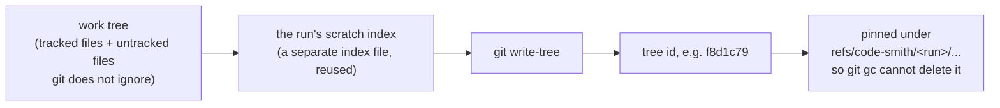
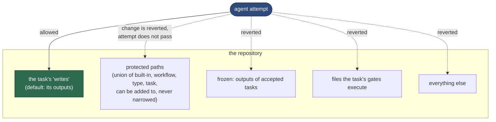
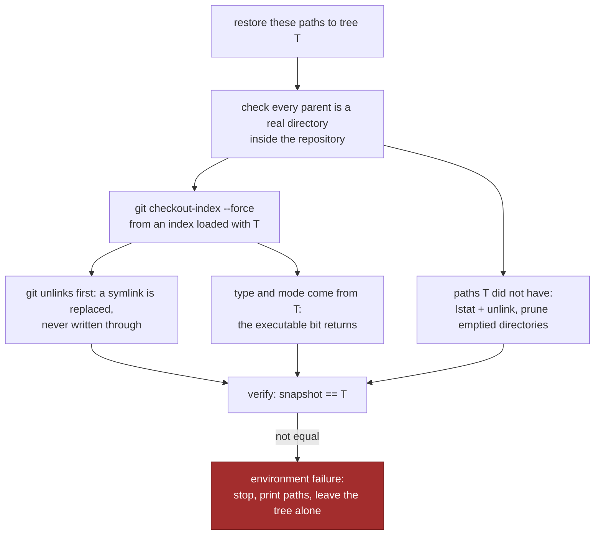
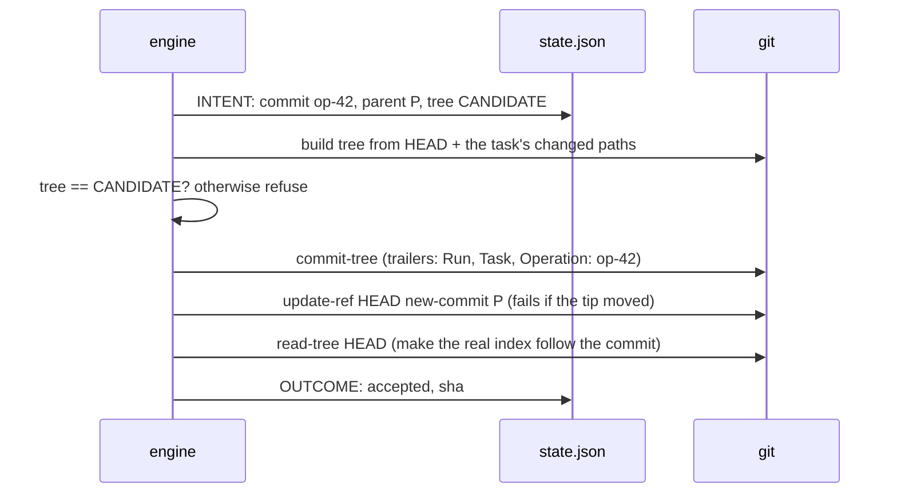
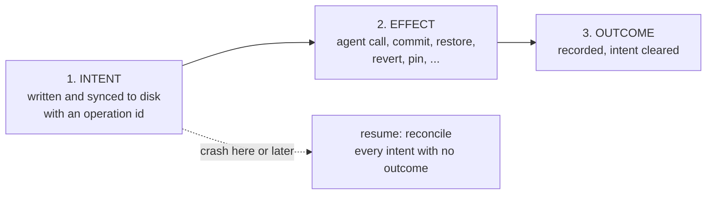

# 4 — Safety: git, the record and recovery

> [!NOTE]
> **Time: 30 minutes, including a 5-minute hands-on crash.** No model was called.

The runner lets agents write to your repository unattended. This chapter explains why that cannot
corrupt it, even when an agent misbehaves, a gate misbehaves, or the machine dies mid-step.

## One primitive: the snapshot

Almost every safety property rests on one operation: **hash the whole work tree into a git tree
id**, without touching your index or your files.



Two trees with the same id are the same content. That turns hard questions into comparisons:

| Question | Answer |
|---|---|
| What did this attempt change? | names that differ between two snapshots |
| Did a gate, a check or a reviewer change anything? | snapshot before == snapshot after? |
| Is the tree clean again after a failure? | snapshot == BASE? |
| Is the commit exactly what was verified? | committed tree == CANDIDATE? |

Because everything rests on git seeing the work, the root **must** be a git repository, declared
paths that git ignores are refused, and `.gitignore`, `.gitattributes` and `.gitmodules` are
protected by default so an agent cannot hide its work from the snapshot.

## What an agent may touch



A later task may change a frozen file only by **claiming** it in its own `writes`, and only if it
depends on the task that made it. `validate` prints every such claim, the claiming task's reviewers
see the diff, and the original task's gates are run again as part of the claimant's verification.

## Restoring files properly

Putting files back sounds trivial and is not. Writing the old bytes over a path follows symbolic
links, which can write **outside the repository**, and loses the executable bit. The runner instead
uses git's own checkout from a separate index loaded with the target tree:



Embedded git repositories and submodule entries, which a restore could not handle, never reach it:
the candidate is scanned right after each attempt and they are removed then.

## Committing exactly what was verified



The last git step matters: without it the index still describes the old tip, `git status` shows
phantom changes, and a later `git revert` refuses to run.

## What a producer owns in git: the lease

The author's prompt says "do not commit, branch, stash, reset or push". An agent with a shell can
still do it, and so can a gate. So when a producer's transaction opens, the runner records a
**lease**: the commit and branch it starts on, the bytes of `.git/info/exclude` and
`.git/info/attributes`, and the run's own refs under `refs/code-smith/`. After every author call,
every gate and check, and before every step, it compares.

Say the author ends its work with `git commit -am wip`. The runner moves the run branch back to the
starting commit and the index back to its tree, and leaves **the work tree untouched**: the files
the author wrote are still there and are judged like any candidate. Nothing the author did to git
can reach the commit any more, so the attempt is not sent back for it; the repair is a
`git-repaired` event and a "Git state put back" section in the task's STATUS.md, and the author's
own commit stays in the reflog. A file hidden through `info/exclude` becomes visible again and is
judged too. Only a merge, rebase, cherry-pick, revert or bisect left half-done stops the run,
because finishing or aborting it is not the runner's decision. When the runner commits, the parent
is the lease's starting commit, and any other `HEAD` is refused.

The runner never runs `reset --hard`, `clean`, `stash`, `push` or `merge`. Undoing accepted work
(`replan --reopen`) adds `git revert` commits; it removes none. The only refs it ever deletes are
its own pins under `refs/code-smith/<run>/`, and only when you run `runner prune` after the run is
done.

## Crashes: intent, effect, outcome

An atomic state file cannot make "run a subprocess, write a commit, update the state" happen
together. So every external effect is bracketed:



| Found on `resume` | Action |
|---|---|
| Commit intent, and the branch tip carries that operation id | It happened. Record acceptance. The author is **not** run again |
| Commit intent, and the tip is still the expected parent | It did not happen. Check the tree still equals the candidate, then commit |
| Commit intent, and the tip is anything else | Someone changed the branch. Stop and say what was expected and found |
| Agent or command intent, and a process of its group is still alive | Refuse to continue beside it, naming the invocation and the pids. `resume --stop-orphans` stops the whole group first |
| Agent intent, no process, no terminal event | Mark it `interrupted`, never successful, and call again in the same attempt: no retry and no attempt used. New invocation directory |
| Replay intent (the acceptance replay's throwaway checkout) | Remove the checkout and verify the candidate again |
| Restore, pin, patch, index sync | Idempotent: do it again, verify |
| Recover intent (set-aside work being put back by `retry --apply-patch`) | If the branch tip is unchanged, restore again from the pinned candidate and verify; otherwise stop and restore nothing |
| Decision intent (a protected file such as `verification.json` being rewritten) | Write it again from the intent, with its integrity entry |
| Half-done revert during `--reopen` | `git revert --abort`, then continue from the first revert not on the branch. If your own uncommitted changes are in the way, stop and ask you to commit or stash them; nothing is discarded |

A process is identified by pid, start time **and boot id**, because pids are reused: start ticks
and boot id from `/proc` on Linux, start time to the microsecond and the boot session id on macOS.

**No agent runs unrecorded.** Every agent call and command starts as a small **supervisor** in a
process group of its own, and the supervisor waits on a pipe. Only after the runner has written the
supervisor's identity to disk does it release the pipe and let the real command start; a runner
killed in between leaves a supervisor that exits without running anything. The supervisor then
stays alive until the last process of its group has exited. That matters because agent CLIs start
children: if the CLI exits but a child it started keeps writing to your tree, the group is still
alive and recognisable. `resume` refuses to start work beside it, and `resume --stop-orphans` stops
the whole group, escalating to `SIGKILL`, until it is empty. A group whose recorded identity does
not match is never signalled. A cleanup failure after an answer arrived also stops the run.
STATUS names the open obligation; `resume --stop-orphans` retries cleanup before using the saved
answer (a plain `resume` closes it only when the group is already gone). If the stop keeps
failing, stop the processes yourself, then `resume --abandon-cleanup` records your ruling.
A repaired review rejection uses its saved answer even when invocation logs were lost.
Guard violations are saved beside answers, so restarting cannot erase the reason to refuse a panel.

**One runner per work tree.** A runner holds an `flock` on its run lock for its whole life. The
lock lives in the git directory (`.git/code-smith/`), so an author's `git clean -fdx` or
`rm -rf .runs` cannot free it while the runner lives; `.runs/lock` is taken beside it for older
runners. A command that starts work or changes a run also holds one on `code-smith.lock` in the work tree's
git directory, so two shells with different `--runs-dir` still cannot both write to one checkout.
The kernel drops a lock when its process dies, however it dies, so the next `resume` takes over a
dead runner's lock safely and two runners can never both take it.

## The record protects itself

`.runs/` is ignored by git, so snapshots cannot see an agent tampering with it. The runner keeps
`integrity.json`, the hashes of every decision-bearing file (every `findings.json`, every finished
result, verdict, verification, inputs, outputs and decision file, and the frozen copies of the
workflow, types and personas the run executes from), and checks them before and after every agent
call and every command. `state.json` is rewritten too often for a manifest, so each job is guarded
by a hash of it taken before and after. A change the runner did not make fails that job.

Detecting a change is half of it; the other half is a way back. The runner keeps the decision
files a second time, as one git tree under `refs/code-smith/<run>/_record`, moved before every save
and holding only the runner's own bytes. Say an author runs `git clean -fdx` "for a clean build":
the whole `.runs/` goes. The runner notices at its next write, saves its state into a recreated
run directory and stops, naming `runner repair-record RUN`. That command puts back every pinned
file that is missing or changed, with a `record-repaired` event, names the attempts whose logs
are gone for good, and `resume` continues from the restored state. A deleted `.runs/.gitignore`
is simpler still: the next save writes it again.

The state also checks itself. Every save of `state.json` tests its cross-field **invariants**: at
most one active producer, an accepted producer has a commit and no open blocker, a `pending_*` key
lives only inside its step, and so on. A real run only reports a broken one (an
`invariant-violation` event and a line under "Needs attention"); the test suite turns it into an
error, so every scenario proves them. And `state.json` carries a `schema_version`: a state written
by an older runner is migrated when it is loaded, recorded by a `state-migrated` event on the first
save, so a run started last month resumes under today's runner. The other way round is refused:
an older runner that meets a state written in a newer shape stops instead of misreading it.

`CODE_SMITH_RUN_DIR` is set only for types that request it (`summarize`), and the runner's own
`CODE_SMITH_RUNS_DIR` is never passed to agents or commands. Hook environments also carry their
invocation path for correlation. Paths are not secrets or access controls: integrity checks enforce
the record contract. Gates receive the reduced command environment.

## Stops hold the tree

A run can stop with a producer's candidate still in the work tree: waiting for a human approval or
an escalated finding, out of budget or tokens, halted by `runner pause`, or stopped by an
environment, network or provider failure. Whatever the cause, the runner records the branch tip and
tree it expects, and `resume` checks them first. If someone edited the tree or committed on the
branch meanwhile, `resume` stops with a reconciliation error instead of guessing.

The token stop line is honest about what it cannot measure. Agents that report no dollar cost
(Codex, Copilot, a command) are stopped by `run_budget_tokens`. A call whose usage cannot be read
afterwards (a killed Copilot call, any command agent) is **held** at the reservation it started
with, a bounded number of tokens, so the run still reaches its line instead of running on past it.
Held tokens are never shown as measured: the stop reason reads "N measured + M held" and names the
calls. A provider refusal seen to end before any work began spends nothing at all.

## Try it

Five minutes, no model. `CODE_SMITH_CRASH_AT` is the hook the test suite uses to kill the runner
at a named point (exit code 70). Kill it in the worst place: after the commit exists but before the
record says so. Set up a fresh copy of the [chapter 2](02-a-task-end-to-end.md#try-it) demo,
up to and including `doctor`, then:

```sh
$TR/runner start command-demo.toml                        # exit 255: waiting for signoff
$TR/runner approve latest signoff
CODE_SMITH_CRASH_AT=commit:after-update-ref $TR/runner resume     # exit 70
git log --oneline -2
$TR/runner status latest
```

```text
4231ae2 Write the demonstration result
0844018 demo
…
| 010 | write | implement | scripted | verifying | 1 |  |  |
```

The commit is on the branch, but the record still says `verifying`. **Predict:** will the next
`resume` commit again, run the author again, or neither?

```sh
$TR/runner resume
git log --oneline -3
```

```text
reconciled: op-0009-3792da61 commit of 'write': the commit had been made; recorded the acceptance (4231ae2)
write: accepted as 4231ae2
run command-demo-20261006T124047Z-9fdbb7ff: done. See …/STATUS.md
4231ae2 Write the demonstration result
0844018 demo
```

Neither: the tip carried the operation id in its `Operation:` trailer (see `git log -1`), so the
commit had happened. Try `CODE_SMITH_CRASH_AT=attempt:counted` on `start` too: after `resume`,
`write` still shows 1 attempt. And while a run waits for signoff, create any file in the repository
and `resume`: it refuses, naming the file, until you remove it. When the run is done,
`runner prune` deletes its pinned refs.

## Check yourself

1. Why does the runner restore files with `git checkout-index` from a separate index instead of
   writing the old bytes back?
2. The machine dies between "commit object written" and "branch moved". What does `resume` do?
3. A run waits for signoff. You fix a typo in the work tree and run `resume`. What happens?
4. Why is `.runs/` protected by `integrity.json` rather than by snapshots?
5. During its attempt the author runs `git checkout -b wip && git commit -am wip`. What happens to
   its files, to the branch, and to the attempt?
6. The runner was killed while Codex was working; Codex's CLI exited, but a test process it started
   is still writing. What does `resume` do, and what does `resume --stop-orphans` do?
7. *(Chapter 2)* After `CODE_SMITH_CRASH_AT=attempt:counted` and `resume`, why is the attempt
   count 1 and not 2?

<details><summary>Answers</summary>

1. Writing bytes follows symbolic links, possibly outside the repository, and loses the executable
   bit. Git's checkout unlinks first and takes type and mode from the tree.
2. The tip is still the expected parent, so the commit did not happen: it checks the tree still
   equals the candidate, then commits.
3. It stops with a reconciliation error naming the changed file. Nothing is changed; put it back,
   then resume.
4. `.runs/` is ignored by git, so snapshots cannot see it. The hashes catch an agent or a command
   editing the record.
5. The runner puts git back as the lease recorded it (the run branch at its starting commit and
   checked out, the index at its tree) and leaves the files where they are. They are judged as
   the candidate; the attempt is not sent back for the git change, which is recorded as
   `git-repaired`.
6. `resume` refuses, naming the invocation and the live pids: the supervisor kept the group
   identifiable after the CLI exited. `--stop-orphans` stops the whole group, escalating until it is
   empty, and only then starts work.
7. The attempt was counted in the same save that recorded the answer and moved on to inspecting
   it, so `resume` inspects that attempt's work instead of running the author again.

</details>

---

| Previous | | Next |
|:--|:-:|--:|
| [3 — Review panels and findings](03-review-panels-and-findings.md) | [Contents](README.md) | [5 — Architecture](05-architecture.md) |

**Reference:** [05 — Git, Crash recovery](../05-architecture.md#git),
[04 — Rules of the record](../04-run-directory.md#rules-of-the-record).
