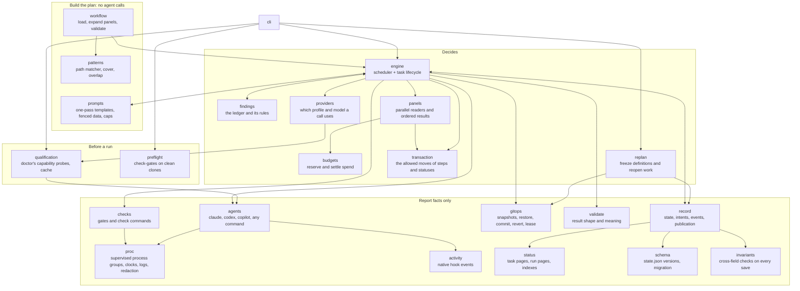
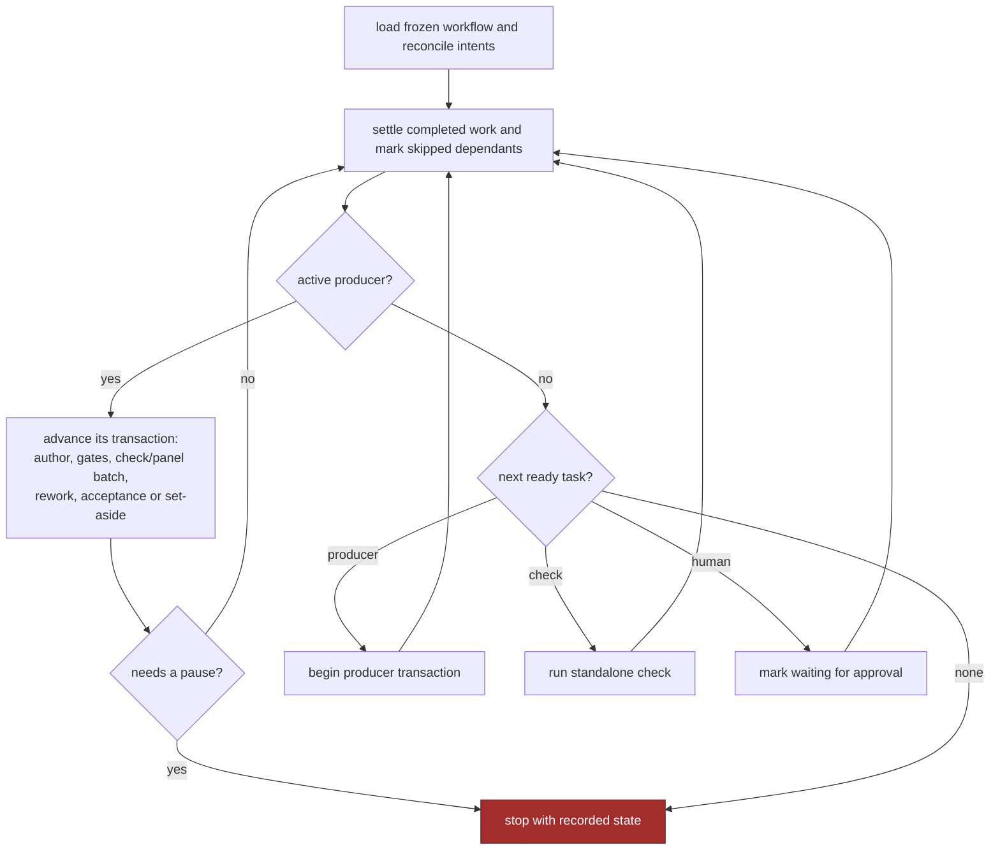
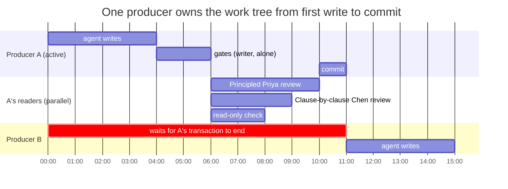
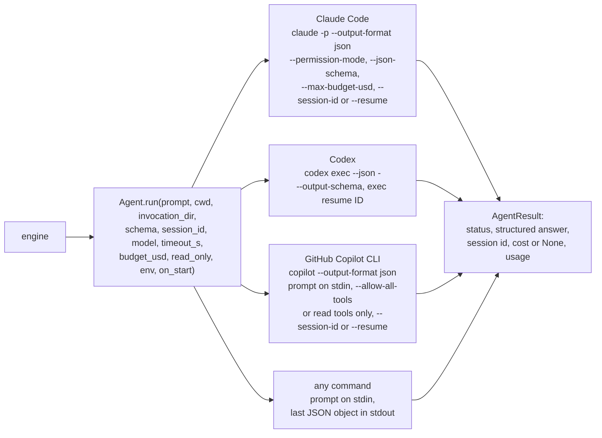
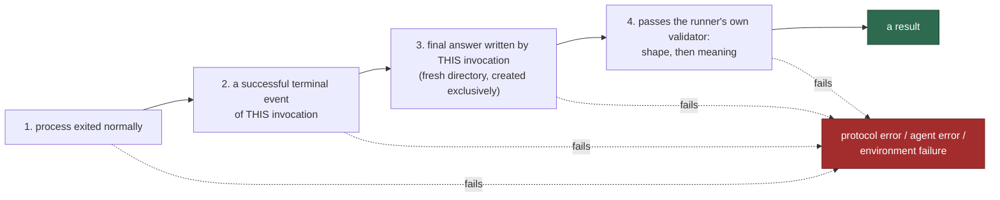

# 5 — Architecture

> [!NOTE]
> **Time: 20 minutes.** No model was called.

## The modules, and who is allowed to decide

Lifecycle decisions live in `engine` and its `panels` and `providers` mixins. `findings` computes
ledger transitions, `budgets` reserves spending, `replan` coordinates definition changes and
reverts, and `transaction` holds the table of moves every one of them must respect. Agent and
command adapters report observations. `record` keeps the state, migrates an older one through
`schema` when it loads it, and checks `invariants` whenever it saves it. `status` renders the
pages and indexes; a rendering error is recorded without stopping saved decisions. The pure ledger
transitions and scripted execution tests exercise decisions without paid model calls.

## The engine loop

Given the same workflow and the same results from agents, the same things happen in the same order.

## The producer transaction

Serial *processes* are not serial *transactions*. If producer A finished writing and independent
producer B started before A's panel ran, B would build on unaccepted work, and B's changes would
leak into A's review and A's commit. So the unit of exclusion is the whole life of a producer.

The hour marks illustrate ordering and overlap; they are not estimates of actual run time.

Inside a transaction, either **one writer** runs or a reader batch runs, never both. A batch
has at most `max_parallel` readers and completes before its results are applied in task order.
Standalone checks are sequential; concurrent readers belong to the active producer’s panel.

### The transaction is a table

A producer's transaction moves through named **steps**: `attempt`, `inspect`, `verify`, `panel`,
`escalation`, `human`, then `commit` or `set-aside`. `transaction.py` lists, for each step, the
steps it may move to, and for each task status the statuses it may move to. Every write of a step
or a status goes through one of four calls (`move`, `set_status`, `open_`, `reset`), which check
the table **before** writing anything. A bug that tried to move a task from `commit` back to
`attempt` would raise a `RunnerError` naming the task and both steps, and stop the run, instead of
leaving a state no `resume` could make sense of. The same table says which keys each boundary
clears: the `pending_*` keys of an attempt (its call in flight, its retries, its interruptions)
disappear on every step move, so none can leak into the next attempt. The full tables are in
[05 — Architecture](../05-architecture.md#the-producers-state-machine-w-04).

## Driving agents

One interface, four adapters. The runner never imports a model SDK; it starts command-line tools
in headless mode and reads what they print.

`proc` starts every call through a supervisor that waits on a pipe. `on_start` hands the runner the
supervisor's identity (pid, process group, start time), the runner writes it to disk, and only then
is the pipe released and the CLI started, so no call can run unrecorded. The supervisor outlives
the CLI until its whole process group has exited. A fresh Claude call is given its own
`--session-id`, so a crashed call's transcript can still be found.

The adapter also sorts failures by whose fault they are. A quota refusal (HTTP 429, "usage limit
reached") is `quota`; an overload, a 5xx or a dropped connection is `transient`. Neither is the
agent's fault, so neither uses an attempt (chapter 2). Which profile and model the next call uses
is decided above the adapters, from the task's `complexity` and `fallback_agents`: see
[provider routing](../provider-routing.md).

### What counts as a result

A call has succeeded only when **all four** hold:

A provider's schema feature makes valid answers likelier; it is never the check. A failing test
*inside* an agent's session is ordinary work, not a failed call. A sandbox that cannot start is an
**environment failure**: it stops the run and uses no attempt, because retrying the work cannot fix
the machine.

### Capabilities are qualified, not assumed

Answering a greeting proves nothing about reading files. `doctor` tests each agent profile per
capability, and every probe is judged by an **effect the runner observes itself**:

| Capability | Proof |
|---|---|
| `answer` | the exact expected object comes back |
| `read` | a random value that exists only in a scratch file appears in the answer |
| `execute` | a probe script writes a SHA-256 digest a model cannot compute without running it |
| `write` | the runner reads the expected change back |
| `resume` | a second call on the session id returns a value given only in the first |
| `boundary` | a sentinel file is unchanged after the agent was asked to modify it read-only |

`write` is probed only for writer profiles and `boundary` only for read-only ones; `resume` only
where the adapter can continue a session. Before any paid probe, a free preflight checks that the
Codex sandbox can start and which features are enabled. Results are cached per profile, model,
mode, binary and host in `.runs/qualification-cache.json`, so `doctor` is not paid for twice.

Types state what they `require`; `doctor` and `start` refuse a workflow whose profiles fall short.
`validate` does not check this, so it works with no agent installed.

## Observability

`activity` routes native hook logs into each invocation. Codex exec events also pass through the
existing logger with an explicit `ExecStream.*` origin. `runner activity [--task T] [--tail N]`
reads these logs while agents run, and `STATUS.md` lists the calls in flight while a runner works.
`runner pause` stops a run at the next safe point (before its next call). Observations do not
decide acceptance. See [headless observability](../headless-observability.md) and the
[runbook](../runbook.md).

## Prompts

Prompts are assembled deterministically, in **one pass over the template only**: substituted text
is never scanned again, so a diff containing `{rules}` or stray braces is harmless. Everything that
comes from a task, an agent or the repository is wrapped in a labelled data block, and the standing
rules distinguish the workflow task specification from repository and agent evidence; no block overrides runner boundaries. Prompts carry pointers and summaries, not
file contents; the agent reads the files itself.

## Limits

| Limit | Default | Enforced by |
|---|---|---|
| attempts per producer | 3 | engine |
| protocol retries per attempt | 2, charged only when a call returns | engine |
| interrupted calls per attempt | 5, then the task is set aside `blocked` | engine |
| time per agent call / per command | 30 min / 20 min | the runner's own clock; whole process group is stopped |
| money per call | $5 | the agent, where it can |
| money per run | $50 | engine, **by reservation** before each call |
| tokens per run, for agents that report no cost | 0 (no cap) | engine, checked before each call; `resume --add-tokens N` |
| parallel readers | 4 | scheduler |

Reservation means four reviewers cannot each start a $5 call with $1 left. Spend is kept as four
numbers. **Known**: dollars the agents reported. **Reserved**: caps held for calls in flight.
**Unsettled**: the cap of a priced call that ended with no price (a time-out, an error, an
interruption); it may have spent up to that cap, so it still counts against the limit. **Unpriced**:
calls and tokens of agents that report no cost, such as Codex, Copilot and command agents, because the
runner does not invent dollars.

For those agents, `run_budget_tokens` is the stop line. Their usage is known only when a call ends,
so each call **reserves** tokens before it starts: `unpriced_call_reserve` if the workflow sets it,
otherwise twice the run's largest measured call and at least 500,000, never more than is left.
Unpriced reviewers start side by side only while their reservations fit under the line together,
so the line is passed by at most one call's overrun per call that ran beside it. A call whose usage
cannot be read afterwards is held at its reservation, shown as "held", never as measured.

## Check yourself

1. Which modules may decide that a task is accepted, and which only report facts?
2. A call exits 0 and prints a valid JSON answer, but the answer was written by an earlier
   invocation. Is it a result?
3. Why does `doctor` judge `execute` by a SHA-256 digest instead of asking "did you run it"?
4. A Claude call times out with $5 reserved and no cost reported. What happens to the $5?
5. A code change makes the engine move a producer from step `human` straight to `set-aside`. What
   happens the first time a run reaches that line, and why is that better than letting it through?
6. *(Chapters 1 and 4)* Why must the engine keep nothing in memory between steps?

Answers

1. `engine` with its `panels` and `providers` mixins, using `findings` and `budgets`, and `replan`.
   `agents`, `checks`, `gitops`, `validate` and `record` report facts.
2. No. All four must hold, including a final answer written by *this* invocation into its own
   fresh directory.
3. Because every probe is judged by an effect the runner observes itself; a model cannot compute
   the digest without running the script.
4. It becomes unsettled spend: it still counts against the run's dollar limit.
5. The table allows only `attempt` or `commit` after `human`, so `move` raises a `RunnerError` before
   writing anything and the run stops. A state the runner has never been tested in is never saved,
   so `resume` never has to make sense of one; and the scenario that reaches the line fails in the
   test suite first.
6. So that `resume` after a crash, at any point, is the normal path: every decision can be rebuilt
   from the record and the intents.

---

| Previous | | Next |
|:--|:-:|--:|
| [4 — Safety: git, the record and recovery](04-safety-git-and-recovery.md) | [Contents](README.md) | [6 — Writing a workflow](06-writing-a-workflow.md) |

**Reference:** [05 — Architecture](../05-architecture.md).
