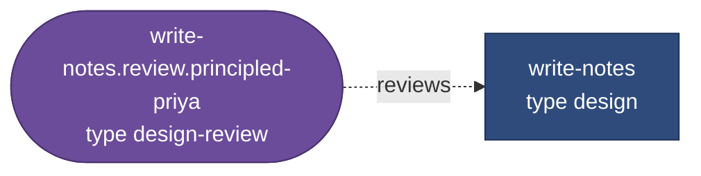
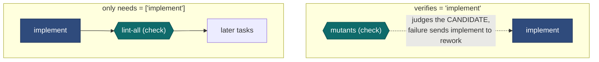

# 6 — Writing a workflow

> [!NOTE]
> **Time: 30 minutes, including a 5-minute hands-on.** Every workflow here was run through
> `runner validate`, and every quoted message was printed by it. No model was called.

## The smallest useful workflow

```toml
name = "hello"

[[task]]
id = "write-notes"
type = "design"
prompt = "Write a one-page note on how the build works."
outputs = ["docs/notes/build.md"]
reviewers = ["principled-priya"]
```

One producer, one reviewer. It loads because the producer has a verifier. Remove `reviewers` and it
is rejected: `task 'write-notes' has no gate, check, review or human verifier`. It loads with a
warning, too: reviewers default to another model family than the author's (`reviewer_family =
"different"`), and this file defines only Claude. Add a `codex` or `copilot` profile, or set
`reviewer_family = "any"` under `[defaults]`.

What the runner makes of it:



The panel shorthand expanded into a review task. Its type came from the producer's type: `design`
names `design-review` as its `review_type`.

## A realistic chain

```toml
name = "book-module"
root = ".."                      # this file lives in workflows/; the repository is one up

[defaults]
agent = "claude"
protected = ["docs/spec/**", "tests/fixtures/**"]

[[task]]
id = "design"
type = "design"
prompt_file = "briefs/book-design.md"        # relative to this file
outputs = ["docs/design/05-order-book.md"]
reviewers = ["principled-priya", "clause-by-clause-chen"]

[[task]]
id = "tests"
type = "test"
needs = ["design"]
outputs = ["tests/book/**"]
gate = ["cmake --build build"]
reviewers = ["clause-by-clause-chen"]

[[task]]
id = "implement"
type = "implement"
needs = ["tests"]
outputs = ["src/book/**"]
writes = ["src/book/**", "CMakeLists.txt"]
gate = [
  "cmake --build build",
  { run = "ctest --test-dir build -R book", new = true, fail_pattern = "book" },
]
reviewers = ["principled-priya", { perspective = "dependable-diego", advisory = true }]

[[task]]
id = "signoff"
type = "human"
needs = ["implement"]
```

Things to notice:

- **`tests` comes before `implement` and is accepted first**, so `tests/book/**` is frozen when the
  implementer runs. The author cannot edit the tests to make them pass.
- **`outputs` versus `writes`.** Outputs are the deliverables: what downstream tasks are pointed
  at and what is frozen. `writes` is everything the task may touch. `CMakeLists.txt` is a helper,
  not a deliverable.
- **A `new` gate** claims to prove this task's behaviour, so it must *fail before* the task is
  done, and for the right reason: `fail_pattern` is a regular expression the failing output must
  match. A plain-string gate is an invariant: it may pass all along; its job is to stay green.
  `runner check-gates` tries every gate on a clean clone of the committed files before you spend
  anything, and reports a gate that fails because its output does not exist yet as
  `fails as intended`.

## Path patterns

One matcher is used for `outputs`, `writes`, `removes` and `protected`.

| Pattern | Matches | Does not match |
|---|---|---|
| `src/book/side.hpp` | that file | anything else |
| `docs/spec/*` | `docs/spec/x.md` | `docs/spec/a/b.md` (`*` never crosses `/`) |
| `docs/spec/**` | `docs/spec/x.md`, `docs/spec/a/b.md` | `docs/spec` itself |
| `src/**/x.h` | `src/x.h`, `src/a/b/x.h` | `src/x.hpp` |
| `*.lock` | `x.lock`, `sub/dir/x.lock` | |

## Standalone steps and verifying steps

A `check` or `human` task is one of two things, depending on one key:



A verifying task must **not** also list its target in `needs`: the target's acceptance would wait
for a verifier that waits for the target's acceptance. `validate` rejects that, and the indirect
version of it, with the dependency trace.

A standalone check that fails is `failed`; there is no author to send it back to.

## What `validate` catches

Run it after every edit. It needs no agent and spends nothing, reports every problem at once, and
then prints the expanded DAG in execution order and every claim on a frozen output. It does not
check that agent profiles can do what their types require; `doctor` and `start` do that. Each
message below is printed after `error: `.

| Mistake | Message (example) |
|---|---|
| A typo in a key (unknown keys are errors everywhere) | `task 'design': unknown key 'ouputs'` |
| A producer nobody checks | `task 'design' has no gate, check, review or human verifier` |
| A dependency cycle | `dependency cycle: a -> b -> a` |
| A verifier that can never run | `acceptance cycle: a -> m -> a: 'm' verifies 'a' and also needs it: 'a' can never be accepted` |
| Two unordered tasks writing the same place | `'extend' and 'implement' both write src/book/** and neither depends on the other` |
| An output git cannot see | `'implement' output build/config.h is ignored by .gitignore:1 'build/'; ignored work is invisible to snapshots, reviewers and commits` |
| An output not covered by `writes` | asks for the entry to be repeated in `writes` |
| Two personas with one finding-id prefix | `personas 'security' and 'clause-by-clause-chen' both use code 'SC'` |
| A deletion the task may not make | `task 'move': removes path 'src/util.py' is not covered by its 'writes'; a deletion is a change, and would be reverted` |

It also **warns**, without failing, when a later task claims a frozen file, when a task may edit a
file its own gate executes, when an agent profile bypasses its sandbox, when `root` is only a
subdirectory of the repository, when a `new` gate has no `fail_pattern`, when an agent reports
no dollar cost and so needs `run_budget_tokens` to be capped, and when every reviewer would share
the author's model family.

## Adding a type or a persona

Both are TOML files in a library directory; a workflow adds its own with `library = ["lib"]`.

A persona is mostly three lists:

```toml
name = "security"
code = "SEC"                         # prefix of its finding ids; unique across the library
title = "Sentinel Sato: what an outsider controls"
focus = ["input validation at trust boundaries", "secrets in code or logs"]
blocking = ["a memory-safety defect reachable from network input"]
out_of_scope = ["naming and style", "build configuration: the dependable-diego reviewer covers it"]
```

Spend the effort on `blocking` and `out_of_scope`. A persona that blocks on taste makes panels
never converge; one without an out-of-scope list repeats what the others say. Name the owner in
each out-of-scope item, as above: the review type's one ownership rule ([chapter
3](03-review-panels-and-findings.md#a-panel-is-a-list-of-personas)) depends on it.

**Put literal requirements in gates, not in personas.** A reviewer reads the code but does not run
it; the gates' output is its execution evidence. So a requirement a script can check (a required
include, the exact shape of an output line, a non-zero exit on bad input) belongs in a gate: it runs
before any paid review, again in the acceptance replay, and its failure goes straight back to the
author. [`examples/contract_gate.py`](../../examples/contract_gate.py) is a starting point to copy
into your project; [03 — Workflow file](../03-workflow-file.md#literal-requirements-belong-in-command-gates)
shows it in use.

## Starting from a template

You rarely need to start from a blank file. `runner new` fills a template from
`library/workflows/` with your project's paths, commands and reviewers, and writes the file only
if it validates. Run these in your project's git checkout. A brief or bug report a template
points at is a file relative to the generated workflow, so copy the examples' briefs beside it
first (the design brief is in `examples/briefs/`, the bug reports and the refactoring brief in
`examples/templates/briefs/`; the bench rules the C++ examples show their reviewers are in
`examples/templates/benches/`):

```sh
mkdir -p briefs benches
cp $TR/examples/briefs/book-design.md $TR/examples/templates/briefs/*.md briefs/
cp $TR/examples/templates/benches/*.md benches/
$TR/runner new --list                         # the templates
$TR/runner new --describe implementation      # its parameters, in the order the template declares them
$TR/runner new implementation -o book.toml --params $TR/examples/templates/implementation.params.toml
```

The result is an ordinary workflow file. Its first lines say which template (and which SHA-256 of
it) made it, on what date, with which values. From then on **the file, not the template, defines
the work**: edit it like any other, and a later change to the template does not reach it. List
values (gates, reviewers, checks) come from the `--params` file; `--set NAME=VALUE` gives a single
string or number. A list left empty simply leaves its tasks out: `mutation = []` gives no mutation
check. The template format is in [03 — Workflow file](../03-workflow-file.md#templates-and-runner-new).

Three templates ship, one per shape of work: `implementation` (build something new), `debugging`
(fix a reported defect) and `refactoring` (change structure, not behaviour). Each stage's review
panel is fixed in the template, one blocking reviewer per question; you **add** reviewers per
stage through its `*_reviewers` parameters, never by editing the template.

**A defect whose evidence is a sanitizer report.** `debugging-sanitizer.params.toml` passes the
`memory-model-mei` bench blocking on every stage (a reproduction of the wrong race would be
frozen), adds `concerned-carlos` to the fix and siblings panels, and names `rules_file =
"benches/cpp-standards.md"`: the C++ rules every author and reviewer of the run is shown, shipped
in `examples/templates/benches/`.

**A defect that starts from a packet capture.** The networking example passes the
`packet-trace-pradip` domain bench, blocking on every stage, the reproduction included: it replays the
committed capture, and only that bench can tell a replay of the reported frames from some other
loss. The report it points at, `briefs/feed-gap-212.md`, is one of the briefs you copied:

```sh
$TR/runner new debugging -o debug-212.toml --params $TR/examples/templates/debugging-network.params.toml
$TR/runner validate debug-212.toml
```

```text
  1  reproduce                             produce/reproduce      agent claude, then codex, copilot [by reviewer_family]
                                           gate: python3 -m compileall -q src
                                           gate: python3 -m pytest -q tests/regression/test_feed_gap_212.py   (must FAIL, matching /GAP after seq \d+/)
  …
  3  reproduce.review.packet-trace-pradip  review/code-review     reviews reproduce; agent copilot, then codex, claude [by reviewer_family]
  …
  8  fix                                   produce/fix            needs reproduce, diagnose; agent claude, then codex, copilot [by reviewer_family]
                                           gate: python3 -m compileall -q src
                                           gate: python3 -m pytest -q tests
                                           gate (new): python3 -m pytest -q tests/regression/test_feed_gap_212.py
  …
 11  fix.review.packet-trace-pradip        review/code-review     reviews fix; agent codex, then copilot, claude [by reviewer_family]
```

Each author runs on Claude and each reviewer on another family, with the rest as fallbacks: that is
`reviewer_family` at work, dealing reviewers across the families the file names.

Read the two gates together: `reproduce` is accepted only while the regression test **fails** with
the reported symptom, and `fix` only when the same file, frozen since, **passes**. `fix` also has
a diff budget (3 files here, 150 lines), so a rewrite in disguise is sent back before any reviewer
reads it. `runner check-gates debug-212.toml` reports the fix's gate as "fails as intended (waits
for reproduce)": the test does not exist yet, and that is expected. `validate` also warns that
`siblings` will modify outputs of `fix`: that is expected too, since `siblings` claims the fix's
area on purpose.

**A refactoring.** The steps are your list, one task and one commit each, every one held to the
characterisation tests and baselines that the first task froze:

```sh
$TR/runner new refactoring -o split-pricing.toml --params $TR/examples/templates/refactoring.params.toml
$TR/runner graph split-pricing.toml | dot -Tsvg > split-pricing.svg    # characterise → step-1..3 → final
```

Here `validate` warns that each `step-N` will modify outputs of the steps before it: expected,
since every step changes the same area, one after the other.

## Beyond the basics: one worked example

Most workflows need only the keys above. The next ones matter as soon as work moves files, runs a
mutation tester, or must survive a provider's quota running out. One example shows them all:

```toml
name = "refactor"

[defaults]
agent = "codex-writer"
run_budget_tokens = 3000000      # Codex reports tokens, not dollars: this is its stop line

[model_policy.mechanical]
codex = "gpt-5.6-luna"
claude = "sonnet"

[model_policy.standard]
codex = "gpt-6-astra"
claude = "sonnet"

[model_policy.high]
codex = "gpt-6-astra"
claude = "opus"

[agents.codex-writer]
kind = "codex"
sandbox = "workspace-write"

[agents.claude-writer]
kind = "claude"

[[task]]
id = "plan"
type = "design"
complexity = "high"
prompt = "Plan moving src/util.py into a src/text/ package."
params = { audience = "a maintainer reviewing the move in ten minutes" }
outputs = ["docs/move-plan.md"]
reviewers = ["principled-priya"]

[[task]]
id = "move"
type = "implement"
needs = ["plan"]
complexity = "mechanical"
fallback_agents = ["claude-writer"]
prompt = "Carry out docs/move-plan.md."
outputs = ["src/text/util.py", { path = "src/text/__init__.py", may_be_empty = true }]
removes = ["src/util.py"]
writes = ["src/text/**", "src/util.py"]
gate = ["python3 -c 'import src.text.util'"]

[[task]]
id = "mutants"
type = "check"
verifies = "move"
restores = true
run = ["python3 -m mutmut run"]
```

| Key | What it buys you |
|---|---|
| `removes` | Paths that must **not** exist afterwards: step 2 of the ladder checks it. A deletion is a change, so each must also be in `writes` |
| `{ path = …, may_be_empty = true }` | An output may be an empty file. Without it, an empty output is "not done" |
| `restores = true` | A check that edits source on purpose and is meant to put it back. The runner restores the candidate itself afterwards. Cannot be combined with `read_only` |
| `params` | Values for the type's own parameters: `design` declares `audience` and uses it as `{param.audience}` in its prompt. An undeclared name is an error |
| `[agents.NAME]` | A named profile: `kind` (`claude`, `codex`, `copilot` or `command`), `model`, `sandbox`, `permission_mode`, `ignore_user_config`, `extra_args`; `argv` and `read_only_args` for a command agent |
| `complexity` | `mechanical`, `standard` (the default) or `high`: how hard the task is to reason about. With `[model_policy.LEVEL]` it picks the model per provider. The review of `plan` has no `complexity`, so it is `standard`, and it runs on the other family (`claude-writer`, with `codex-writer` as its fallback): that is why `standard` needs a row too |
| `fallback_agents` | Profiles to move to, in order, when the provider's quota runs out or it fails twice. Each must resolve a model: here `model_policy.mechanical.claude` |
| `run_budget_tokens` | The token stop line for agents that report no dollar cost. `0`, the default, means no cap; `resume --add-tokens N` raises it |
| `unpriced_call_reserve` | Under that line, the tokens one such call reserves before it starts. `0`, the default, means twice the run's largest call so far and at least 500,000. Lower it to let more unpriced reviewers run side by side |
| `acceptance_replay`, `gate_cache` | The acceptance replay (chapter 2) is on by default; `acceptance_replay = false` turns it off for the workflow or one task. `gate_cache = ["build/"]` copies those ignored paths into the clean checkout first, when a cold build is too slow: you vouch for them |

Every other key, with its default (`title`, `timeout_min`, `budget_usd`, `max_attempts`,
`recheck_passed`, `branch`, `max_parallel`, the prompt size caps, …), is in
[03 — Workflow file](../03-workflow-file.md); routing in detail is in
[provider routing](../provider-routing.md).

## Try it

Five minutes, no model (`TR` is set as in [chapter 2](02-a-task-end-to-end.md#try-it)). Save the
example above as `refactor.toml` in a scratch git repository and validate it:

```sh
mkdir /tmp/wf && cd /tmp/wf && git init -q -b main
mkdir src && echo 'x=1' > src/util.py && git add . && git commit -qm init
# save the example as refactor.toml
$TR/runner validate refactor.toml
```

```text
warning: agent 'codex-writer' reports no dollar cost: dollar limits do not bind on it; time and attempts still apply, and usage is recorded as unpriced; run_budget_tokens stops the run once 3000000 tokens were used
workflow refactor: 4 tasks, in execution order
…
  2  plan.review.principled-priya  review/design-review   reviews plan; agent claude-writer, then codex-writer [by reviewer_family]
  3  move                          produce/implement      needs plan; agent codex-writer, then claude-writer
                                   outputs: src/text/util.py, src/text/__init__.py
                                   writes:  src/text/**, src/util.py
                                   removes: src/util.py
                                   gate: python3 -c 'import src.text.util'
  4  mutants                       check                  verifies move; restores
```

Now break it three ways, one at a time, and **predict each message before you run `validate`**:
drop `"src/util.py"` from `writes`; delete the line `claude = "sonnet"`; add `read_only = true` to
`mutants`. You should get:

```text
error: task 'move': removes path 'src/util.py' is not covered by its 'writes'; a deletion is a change, and would be reverted
error: task 'move': fallback agent 'claude-writer' needs a profile model or complexity model mapping
error: task 'mutants': 'read_only' and 'restores' cannot both be true
```

## Check yourself

1. Why does `tests` come before `implement` in the book-module chain, rather than in the same task?
2. A check task has both `verifies = "implement"` and `needs = ["implement"]`. What does `validate`
   say, and why?
3. What is the difference between `outputs` and `writes`?
4. A Codex task has no `run_budget_tokens`. What limits its spend?
5. The brief says every output line must end in `ns/op`. Where should that requirement be checked,
   and why there?
6. *(Chapter 3)* Your new persona blocks on naming style. What will happen to panels that use it?

<details><summary>Answers</summary>

1. So `tests/book/**` is accepted and frozen before the implementer runs: it cannot edit the tests
   to make them pass.
2. An acceptance cycle: `implement` can be accepted only after its verifier passes, and the
   verifier waits for `implement` to be accepted.
3. `outputs` are the deliverables: what downstream tasks are pointed at and what gets frozen.
   `writes` is everything the task may touch, outputs included.
4. Only time and attempts: dollar limits do not bind on an agent that reports no cost, which is why
   `validate` warns.
5. In a gate (a small script such as `contract_gate.py`). It is cheap, runs before any paid review
   and again in the acceptance replay, and a reviewer, who does not run the product, would only be
   guessing at it.
6. They may never converge: every rework can draw a new blocker on taste until attempts run out
   and the task ends `blocked`. Spend the effort on `blocking` and `out_of_scope`.

</details>

---

| Previous | | Next |
|:--|:-:|--:|
| [5 — Architecture](05-architecture.md) | [Contents](README.md) | [Runbook](../runbook.md) |

**Reference:** [03 — Workflow file](../03-workflow-file.md), [library/README](../../library/README.md).
